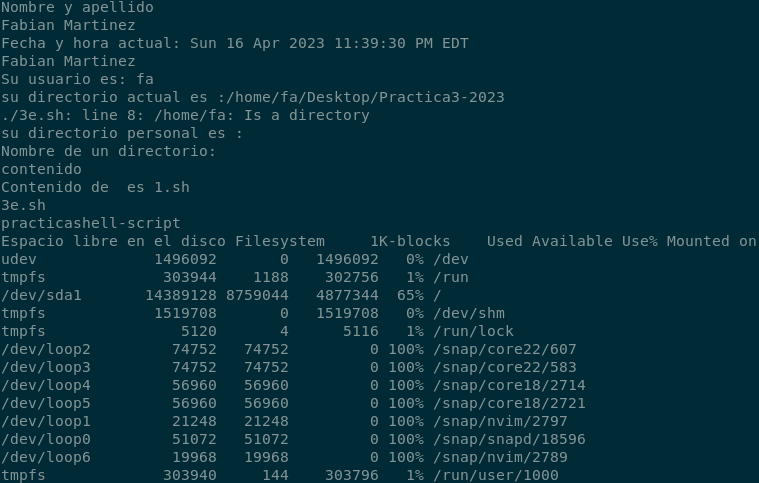
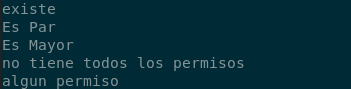
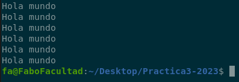
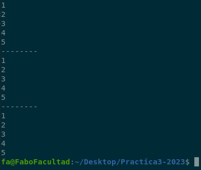
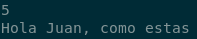
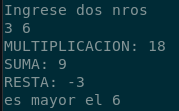
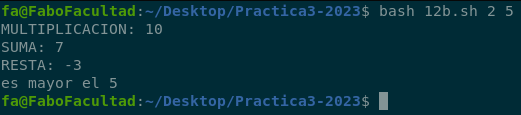
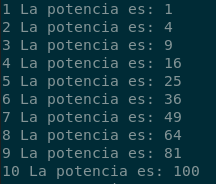
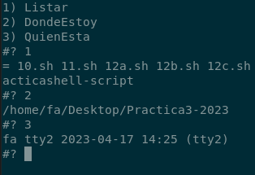

<h1 align="center"> 📚 Practica 3</h1>
  

  
<div align="center">
  
[Siguiente](Practica4.md )<br>
[Anterior](Practica2.md )
  
</div>
  

  
- [1) ¿Qué es el Shell Scripting? ¿A qué tipos de tareas están orientados los script?](#1-ejercicio )
- [2) Investigar la funcionalidad de los comandos echo y read](#2-ejercicio )
- [3) Crear dentro del directorio personal del usuario logueado un directorio](#3-ejercicio )
- [4) Parametrización](#4-ejercicio )
- [5) ¿Cual es la funcionalidad de comando exit?](#5-ejercicio )
- [6) El comando expr permite la evaluación de expresiones](#6-ejercicio )
- [7) El comando “test expresión” permite evaluar expresiones](#7-ejercicio )
- [8) Estructuras de control](#8-ejercicio )
- [9) ¿Qué acciones realizan las sentencias break y continue dentro de un bucle?](#9-ejercicio )
- [10) ¿Qué tipo de variables existen? ¿Es shell script fuertemente tipado?](#10-ejercicio )
- [11) ¿Pueden definirse funciones dentro de un script? ¿Cómo?](#11-ejercicio )
- [12) Evaluación de expresiones](#12-ejercicio )
- [13) Uso de las estructuras de control](#13-ejercicio )
- [14) Renombrando Archivos: haga un script que renombre solo archivos](#14-ejercicio )
- [15) Comando cut](#15-ejercicio )
- [16) Realizar un script que reciba como parámetro una extensión](#16-ejercicio )
- [17) Escribir un script que al ejecutarse imprima en pantalla los nombre](#17-ejercicio )
- [18) Crear un script que verifique cada 10 segundos si un usuario se ha](#18-ejercicio )
- [19) Escribir un Programa de “Menu de Comandos Amigable con el Usuario”](#19-ejercicio )
- [20) Realice un script que simule el comportamiento de una estructura de PILA](#20-ejercicio )
- [21) Dentro del mismo script y utilizando las funciones implementadas](#21-ejercicio )
- [22) Dada la siguiente declaración al comienzo de un script](#23-ejercicio )
- [23) Implemente un script que recorra un arreglo compuesto por números](#23-ejercicio )
- [24) Dada la definición de 2 vectores del mismo tamaño y cuyas](#24-ejercicio )
- [25) Realice un script que agregue en un arreglo todos los nombres](#25-ejercicio )
- [26) Escriba un script que reciba una cantidad desconocida de parámetros](#26-ejercicio )
- [27) Realice un script que implemente a través de la utilización](#27-ejercicio )
- [28) Realice un script que reciba como parámetro el nombre de un directorio](#28-ejercicio )
- [29) Implemente un script que agregue a un arreglo todos los archivos](#29-ejercicio )
- [30) Realice un script que mueva todos los programas del directorio actual](#30-ejercicio )
  

  
##  1) Ejercicio
  
¿Qué es el Shell Scripting? ¿A qué tipos de tareas están orientados los script?  ¿Los scripts deben compilarse? ¿Por qué?
  
La Shell provee estructuras de control que permiten programar shell scripts. 
  
El Shell Scripting es la técnica (habilidad / destreza) de diseñar y crear Script (archivo de automatización de tareas) mediante un Shell (preferiblemente) de un Sistema Operativo, o un
  
Editor de Texto (Gráfico o Terminal). Este es un tipo de lenguaje de programación que generalmente es interpretado.
  
Está orientado a diferentes tareas:
- Automatización de tareas
- Aplicaciones interactivas
- Aplicaciones con interfaz gráfica (con el comando zenity, por ejemplo). 
  

  
##  2) Ejercicio
  
  
Investigar la funcionalidad de los comandos echo y read
  
- `Echo:` Es un comando para la impresión de un texto en pantalla. El comando para imprimir el contenido de la variable es:
- `echo  Ejemplo
  
  
  
Para hacer un script:
- `Paso 1` en la consola usar el comando: `touch script.sh` para crear el directorio.
- `Paso 2` Ver si se creo el directorio con el comando `ls`
- `Paso 3` Ingresar al archivo `script.sh` con el editor de texto vi de la siguiente manera 
   - `vim script.sh `
   - DENTRO DEL EDITOR VIM:
   - Ingresar la letra i para estar en modo insertar y Escribir
   ```bash
   #!/bin/bash 
   CAD="¡Hola Mundo!"
   echo $CAD
   ```
   - `ESC` (para salir del modo editor)
   - `:wq` (para guardar los cambios)
   - Salimos del editor vi e ingresamos a la consola
- `Paso 4:` Damos permiso de ejecución con el comando:
   - `chmod u+x script.sh`
   - Si ponemos el comando ls vamos a ver que el directorio .sh cambio de color.
- `Paso 5:` Con el comando `./script.sh` vamos a ver el contenido de ese script en cosola.
- `Paso 6:` Si queremos borrar ese directorio con script solo es necesario poner en consola el comando `rm script.sh`
  
Tambien podes ejecutar el script con el comando `bash script.sh`
  
  
  

  
##  3) Ejercicio
  
  
Crear dentro del directorio personal del usuario logueado un directorio llamado practicashell-script y dentro de él un archivo llamado mostrar.sh cuyo contenido sea el siguiente:
  
<table>
<td>
  
```sh
#!/bin/bash
# Comentarios acerca de lo que hace el script
# Siempre comento mis scripts, si no hoy lo hago
# y mañana ya no me acuerdo de lo que quise hacer
echo "Introduzca su nombre y apellido:"
read nombre apellido
echo "Fecha y hora actual:"
date
echo "Su apellido y nombre es:"
echo "$apellido $nombre"
echo "Su usuario es: `whoami`"
echo "Su directorio actual es:"
```
  
</td>
<td>
  

  
</td>
</table>
  
  
  
  
  
####  **(a)** Asignar al archivo creado los permisos necesarios de manera que pueda ejecutarlo
  
####  **(b)** Ejecutar el archivo creado de la siguiente manera: ./mostrar
  
####  **(c)** ¿Qué resultado visualiza?
  

  
####  **(d)** Las backquotes (`) entre el comando whoami ilustran el uso de la sustitución de comandos. ¿Qué significa esto?
  
Son para poder ejecutar comando cuando se encuentran dentro de un string 
  
####  **(e)** Realizar modificaciones al script anteriormente creado de manera de poder mostrar distintos resultados (cuál es su directorio personal, el contenido de un directorio en particular, el espacio libre en disco, etc.). Pida que se introduzcan por teclado (entrada estándar) otros datos.
  
  
  
  
<table>
<td>
  
```sh
#!/bin/bash
  
echo "Nombre y apellido"
read nombre apellido
echo "Fecha y hora actual: `date`"
echo $nombre $apellido
echo "Su usuario es: `whoami`"
echo "su directorio actual es :`pwd`"
echo "su directorio personal es : `$HOME`"
echo "Nombre de un directorio:"
echo contenido
echo "Contenido de $contenido es `ls $contenido`"
echo "Espacio libre en el disco `df`"
```
  
</td><td>
  
 
  
</td></table>
  

  
##  4) Ejercicio
  
  
Parametrización: ¿Cómo se acceden a los parámetros enviados al script al momento de su invocación? ¿Qué información contienen las variables `*, HOME` dentro de un script?
  
- Los scripts pueden recibir argumentos en su invocación. Para accederlos, se utilizan variables especiales:
- `1, 3,...` contienen cada uno de los argumentos.
- `*` contiene la lista de todos los argumentos separados por espacios.
- `0"
echo "3"
echo "*"
echo "?` de la siguiente manera:
- Ingresamos al editor VIM con el archivo mostrar.sh
- Una vez hecho el bin bash, como última línea y dentro de insertar ingresamos el siguiente comando: echo (expr 10 - 5)
MULTIPLICACION=(expr 10 / 5)
MODULO=(expr length "Fabian")
SUBSTR="Fabian 1 6: "(expr index "Fabian" b)
  
echo "var1 = 10, var2 = 5"
echo "SUMA RESTA"
echo "MULTIPLICACION DIVISION"
echo "MODULO LONGITUD"
echo "SUBSTR INDICE"
```
  
</td><td>
  

  
</td></table>
  
  

  
##  7) Ejercicio
  
  
El comando **“test expresión”** permite evaluar expresiones y generar un valor de retorno, true o false. Este comando puede ser reemplazado por el uso de corchetes de la siguiente manera **[ expresión ]**. Investigar que tipo de expresiones pueden ser usadas con el comando test. Tenga en cuenta operaciones para: evaluación de archivos, evaluación de cadenas de caracteres y evaluaciones numéricas.
  
Este comando tiene un código de retorno igual a 0 cuando el test es positivo, y diferente de cero en caso contrario
  
El comando test posee dos sintaxis: **test expresión** y **[ expresión ]**, donde **expresión** representa el test que se debe efectuar
  
<table><td>
  
```sh
#!/bin/bash
  
var1=10
var2=5
  
if [ -e 7.sh ]; then echo "existe"; else echo "no existe"; fi
  
if (( $var1 % $var2 == 0 )); then echo "Es Par"; else echo "Es Impar"; fi
  
if (( $var1 > $var2 )); then echo "Es Mayor"; else echo "Es Menor"; fi
  
if [ -r 7.sh -a -w 7.sh -a -x 7.sh ]; then echo "Todos los permisos"
else echo "no tiene todos los permisos"; fi
  
if [ -r 7.sh -o -w 7.sh -o -x 7.sh ]; then echo "algun permiso"
else echo "no tiene todos los permisos"; fi
```
  
</td><td> 
  

  
</td></table>
  
###  Valores a tener en cuenta
  
  
<table>
  
<td>
  
| Parametro | Valor |
| --- | --- |
| -r | Si es de Lectura |
| -w | Si es de escritura |
| -x | Si es de ejecución |
| -a | and |
| -o | or |
| -e | Si existe |
| -d | Si es un directorio |
| -f | Si es un archivo |
| -n | No es cadena vacia |
  
</td>
  
<td>
  
| Operador | Con Strings | Con números | Operaciones |
| --- | --- | --- | --- |
| Igualdad | [ edad -eq 20 ] | nombre != "Maria" ] | [ (( 3 != 4 )) |
| Mayor | [ A > Z ] | [ 5 -gt 20 ] | ( 2 >= 1 )) |
| Menor | [ A < Z ] | [ 5 -lt 20 ] | (( 3 <= 5 )) |
  
</td>
</table>
  
  

  
##  8) Ejercicio
  
  
Estructuras de control. Investigue la sintaxis de las siguientes estructuras de control incluidas en shell scripting:
  
<table>
  
<tr>
<td>
  
```sh
#!/bin/bash
if [ 3 -eq 3 ]; then
  echo "Son iguales"
else
  echo "Son distintos"
fi
```
</td>
<td>
  
 
</td>
</tr>
  
<tr>
<td>
  
```sh
#!/bin/bash
echo "Ingrese un caracter"
read letra
case $letra in
  [a-z]) echo "Es una minuscula";;
  [A-Z]) echo "Es una mayuscula";;
  [0-9]) echo "Es un nro";;
  *) echo "Ingreso un caracter invalida";;
esac
```
</td>
<td>
  

</td>
</tr>
  
<tr>
<td>
  
```sh
#!/bin/bash
var1=0
while [ $var1 -le 5 ]
do
  echo "Hola mundo"
  var1=$((var1+1))
done
```
</td>
<td>
  

</td>
</tr>
  
<tr>
<td>
  
```sh
#!/bin/bash
for var in 1 2 3 4 5
do
  echo $var
done
echo "--------"
for var2 in {1..5}
do
  echo $var2
done
echo "--------"
for ((i=1; i<=5; i++))
do
  echo $i
done
```
</td>
<td>
  

</td>
</tr>
  
<tr>
<td>
  
```sh
#!/bin/bash
select opcion in opcion1 opcion2
do
  case $opcion in
    opcion1) echo "Opcion1" ;;
    opcion2) echo "Opcion2";;
    *) exit;;
  esac
done
```
</td>
<td>
  

  
</td>
</tr>
</table>
  
  

  
##  9) Ejercicio
  
  
¿Qué acciones realizan las sentencias break y continue dentro de un bucle? ¿Qué parámetros reciben?
  
- **`break [n]`** Corta la ejecución de `n` niveles de loops.
- **`continue [n]`** salta a la siguiente iteración del enésimo loop que contiene esta instrucción
  
<table><td>
  
```sh
#!/bin/bash/
contador=0
while true
do
  let contador++
  if [ $contador -eq 10 ]; then
    break
  elif [ $contador -eq 5 ]; then
    continue
  fi
  echo $contador
done
```
</td><td>
  

  
</td></table>
  

  
##  10) Ejercicio
  
¿Qué tipo de variables existen? ¿Es shell script fuertemente tipado? ¿Se pueden definir arreglos? ¿Cómo?
  
bash soporta `strings` y `arrays`
- Los nombres son case sensitive
- Para crear una variable:
   - NOMBRE="pepe" # SIN espacios alrededor del =
- Para accederla se usa NOMBRE
  
Para evitar ambigüedades se pueden usar llaves:
  
- Esto no accede a NOMBREesto_no_es_parte_de_la_variable
- Esto sí
- echo {arreglo[0]} | retorna "valor1" |
| {arreglo[@]} | Retorna todos los elementos del array |
| array
echo "index 3" {array[*]}
echo "Cantidad de elementos" ?
- Reciben argumentos en las variables 2, etc
  
Para definir variables locales podemos usar la palabra clave `local var1`
  
<table><td>
  
```sh
#!/bin/bash
sumar(){
  return $(( $1 + $2 ))
}
cadena(){
  echo "Hola $1, como estas"
}
  
sumar 2 3
echo $?
mensaje=$(cadena "Juan")
echo $mensaje
```
</td><td>
  

</td></table>
  

  
##  12) Ejercicio
  
  
Evaluación de expresione
  
####  **(a)** Realizar un script que le solicite al usuario 2 números, los lea de la entrada Standard e imprima la multiplicación, suma, resta y cual es el mayor de los números leídos.
  
  
  
<table><td>
  
```sh
#!/bin/bash
  
echo "Ingrese dos nros"
read nro1 nro2
echo "MULTIPLICACION: $(( $nro1 * $nro2 ))"
echo "SUMA: $(( $nro1 + $nro2 ))"
echo "RESTA: $(( $nro1 - $nro2 ))"
  
if [ $nro1 -gt $nro2 ]; then
  echo "es mayor el $nro1"
else 
  echo "es mayor el $nro2"
fi
```
</td><td>
  

</td></table>
  
####  **(b)** Modificar el script creado en el inciso anterior para que los números sean recibidos como parámetros. El script debe controlar que los dos parámetros sean enviados.
  
  
<table><td>
  
```sh
#!/bin/bash
  
if (( $# != 2 )); then exit 0; fi
  
echo "MULTIPLICACION: $(( $1 * $2 ))"
echo "SUMA: $(( $1 + $2 ))"
echo "RESTA: $(( $1 - $2 ))"
  
if [ $1 -gt $2 ]; then
  echo "es mayor el $1"
else 
  echo "es mayor el $2"
fi
```
</td><td>
  

</td></table>
  
####  **(c)** Realizar una calculadora que ejecute las 4 operaciones básicas: +, - ,*, %. Esta calculadora debe funcionar recibiendo la operación y los números como parámetros
  
  
<table><td>
  
```sh
#!/bin/bash
select operacion in Multiplicacion Suma Resta CualEsMayor Cerrar
do
   case $operacion in
      Multiplicacion) echo "MULTIPLICACION: $(( $1 * $2 ))" ;;
      Suma) echo "SUMA: $(( $1 + $2 ))" ;;
      Resta) echo "RESTA: $(( $1 - $2 ))" ;;
      CualEsMayor) 
         if [ $1 -gt $2 ]; then echo "es mayor el $1";
         else echo "es mayor el $2" ;fi
         ;;
      Cerrar|*) exit ;;
   esac  
done
```
</td><td>
  

</td></table>
  

  
##  13) Ejercicio
  
  
Uso de las estructuras de control
  
####  **(a)** Realizar un script que visualice por pantalla los números del 1 al 100 así como sus cuadrados.
  
  
  
<table><td>
  
```sh
#!/bin/bash
for i in {1..100}
do
  echo "$i La potencia es: $(($i * $i))"
done
```
</td><td>
  

</td></table>
  
####  (b) Crear un script que muestre 3 opciones al usuario: Listar, DondeEstoy y QuienEsta. Según la opción elegida se le debe mostrar:
  
- Listar: lista el contenido del directoria actual.
- DondeEstoy: muestra el directorio donde me encuentro ubicado.
- QuienEsta: muestra los usuarios conectados al sistema.
  
<table><td>
  
```sh
#!/bin/bash
select opcion in Listar DondeEstoy QuienEsta
do
  case $opcion in
    Listar) echo $(ls) ;;
    DondeEstoy) echo $(pwd);;
    QuienEsta) echo $(who);;
    *) exit;;
  esac
done
```
</td><td>
  

</td></table>
  
####  (c) Crear un script que reciba como parámetro el nombre de un archivo e informe si el mismo existe o no, y en caso afirmativo indique si es un directorio o un archivo. En caso de que no exista el archivo/directorio cree un directorio con el nombre recibido como parámetro
  
  
<table><tr><td>
  
```sh
#!/bin/bash
if (( $# != 1 )); then exit; fi
  
fi [ -e $1 ]; then
   echo "El archivo $1 existe"
   fi [ -f $1 ]; then echo "Y es un archivo"; fi
   fi [ -d $1 ]; then echo "Y es un directorio"; fi
   exit
fi
mkdir $1
```
</td></tr><tr><td>
  

</td></tr></table>
  

  
#  14) Ejercicio
  
  
Renombrando Archivos: haga un script que renombre solo archivos de un directorio pasado como parametro agregandole una CADENA, contemplando las opciones:
- **“-a CADENA”:** renombra el fichero concatenando CADENA al final del nombre del archivo
- **“-b CADENA”:** renombra el fichero concantenado CADENA al principio del nombre
del archivo
  
  
Ejemplo:
  
- Si tengo los siguientes archivos: /tmp/a /tmp/b
- Al ejecutar: ./renombra /tmp/ -a EJ
- Obtendré como resultado: /tmp/aEJ /tmp/bEJ
- Y si ejecuto: ./renombra /tmp/ -b EJ
- El resultado será: /tmp/EJa /tmp/EJb
  
Comandos ejecutados
- bash 14.sh prueba -a Ej 
- Despues 
- bash 14.sh prueba -b Ej 
  
  
<table>
<td>
  
```sh
#!/bin/bash
if [ $# -ne 3 ]; then 
  echo  -e "
  Parametros: \n
  Path \n
  -a/-b \n
  sufijo/prefijo
"; exit;fi
  
if ! [ -e $1 ]; then 
  echo "El path ingresado no existe"
  exit
fi
cd $1
archivos="$(ls)"
ls -1
if [ $2 = "-a" ];then
  for i in ${archivos[*]};do mv $i $i$3;done
elif [ $2 = "-b" ];then
  for i in ${archivos[*]};do mv $i $3$i;done
else
  echo "Tiene que ingresar -a o -b"
fi
echo "Despues de todo:"
ls -1
```
  
</td>
<td>
  

  
</td>
</table>
  
  
  

  
##  15) Ejercicio
  
  
**Comando cut**. El comando cut nos permite procesar la líneas de la entrada que reciba (archivo, entrada estándar, resultado de otro comando, etc) y cortar columnas o campos, siendo posible indicar cual es el delimitador de las mismas. Investigue los parámetros que puede recibir este comando y cite ejemplos de uso.
  
Comando cut : Su principal utilidad es la de borrar secciones, campos o caracteres de la salida de un comando o de cada una de las líneas de un fichero de texto.
  
Ejemplos de uso:
- Mostrar los caracteres que nos interesen en una línea de texto o en un conjunto de líneas
- Imaginemos que tenemos un fichero de texto con el nombre `geekland.txt` que tiene el siguiente contenido:
   ``` 
   la utilidad
   es fácil de usar y es útil
   ```
- Si únicamente queremos mostrar el cuarto carácter de cada una de las líneas lo haremos con la opción `-c 4`
- `cut -c 4 geekland.txt`
   ```
   u
   f
   ```
- Si ahora queremos mostrar los caracteres del 2 al 6:
- `cut -c 2-6 geekland.txt`
   ```
   a uti
   s fá
   ```
- Si finalmente queremos mostrar los caracteres 1,2,3 y 5,6,7 y 8 de cada una de las líneas de un fichero de texto:
- `cut -c 1-3,5-8 geekland.txt`
   ```
   la tili
   es áci
   ```
  
Cut también ofrece la posibilidad de seleccionar un carácter inicial y seleccionar el resto de caracteres hasta el final. Por ejemplo para seleccionar el texto a partir del carácter 5 hasta el final usaremos la opción `-c 5-` del siguiente modo:
- `cut -c 5- geekland.txt`
   ```
   tilidad cut
   ácil de usar y es útil
   ```
  
O también permite seleccionar un carácter final y seleccionar el resto de caracteres hasta el inicio de la frase o fichero. Por lo tanto para mostrar desde el carácter 4 hasta el inicio de la frase lo haremos del siguiente modo:
- `cut -c -4 geekland.txt`
   ```
   la u
   es f
   ```
- Capturar texto a partir de un delimitador y fijando el campo que queremos mostrar
- Si únicamente queremos mostrar la tercera palabra:
- `a)` Cada palabra esta separada por un espacio. Por lo tanto tendremos que fijar el espacio como delimitador. Para fijar el espacio como delimitador lo haré con la opción
- `-d ' '`
- `b)` A continuación hay que definir la palabra que queremos mostrar. si queremos
mostrar la tercera palabra lo haremos con la opción –f2. La opción –f2 hace que se
muestre la palabra que hay entre el segundo y tercer delimitador.
- `cut -d ' ' –f2`
   ```
   utilidad
   fácil
   ```
- Ahora imaginemos que la salida del comando cat /etc/passwd es la siguiente:
- `cat /etc/passwd`
   ```
   root:x:0:0:root:/root:/bin/bash
   daemon:x:1:1:daemon:/usr/sbin:/usr/sbin/nologin
   bin:x:2:2:bin:/bin:/usr/sbin/nologin
   sys:x:3:3:sys:/dev:/usr/sbin/nologin
   ...
   ```
  
Si únicamente queremos mostrar los usuarios podemos fijar que el delimitador sea : y a posteriori definir que se muestre el primer campo. Para hacer lo que acabo de mencionar podemos usar el siguiente comando:
- `cut -d ':' -f1 /etc/passwd`
```
root
daemon
bin
sys
... 
```
  

  
##  16) Ejercicio
  
  
Realizar un script que reciba como parámetro una extensión y haga un reporte con 2
columnas, el nombre de usuario y la cantidad de archivos que posee con esa extensión. Se debe guardar el resultado en un archivo llamado **reporte.txt**
  
  
Funciona un toque raro el find
```sh
#!/bin/bash
  
if [ $# -ne 1 ]; then echo "error"; exit 1; fi
  
cadena=""
for i in $(cat /etc/passwd) 
do
  usuario=$(echo $i | cut -d: -f1)
  path=$(echo $i | cut -d: -f6)  
  cadena+="$usuario $(find $path -name "*$1" | wc -l) \n"
done
echo -e "$cadena" > reporte.txt
```
  

  
##  17) Ejercicio
  
  
Escribir un script que al ejecutarse imprima en pantalla los nombre de los archivos que se encuentran en el directorio actual, intercambiando minúsculas por mayúsculas, además de eliminar la letra a (mayúscula o minúscula). Ejemplo, directorio actual:
  
```bash
IsO
pepE
Maria
Si ejecuto: ./ejercicio17
```
Obtendré como resultado
  
```
iSo
PEPe
mRI
```
  
**Ayuda**: Investigar el comando **tr**
  
```sh
#!/bin/bash
  
archivos=$(ls)
for i in $archivos
do
  nuevo=$(echo $i | tr '[:lower:][:upper:]' '[:upper:][:lower:]' | tr -d 'aA')
  echo $nuevo
done
```
  
Tambien podemos eliminar de la siguiente manera
- `nuevo_nombre={archivo^^}` Todo a mayuscula
- `nuevo_nombre=i | tr [a-zA-Z] [A-Za-z] | tr -d 'aA'
  

  
##  18) Ejercicio
  
  
Crear un script que verifique cada 10 segundos si un usuario se ha loqueado en el sistema (el nombre del usuario será pasado por parámetro). Cuando el usuario finalmente se loguee, el programa deberá mostrar el mensaje ”Usuario XXX logueado en el sistema” y salir.
  
```sh
#!/bin/bash
  
if [ $# -ne 1 ]; then 
  echo "Parametros incorrectos"; exit 1; 
fi
  
usuarios=$(cat /etc/passwd | cut -d: -f1 | grep -w $1 | wc -l)
if [ $usuarios -eq 0 ]; then
  echo "El usuario pasado no existe"; exit 2;
fi
  
while true
do
  if [ $(users | grep -w $1 | wc -l) -eq 1 ]; then
    echo "usuario $1 logueado en el sistema"
    exit
  fi  
  sleep 10
done
```
  

  
##  19) Ejercicio
  
  
Escribir un Programa de “Menu de Comandos Amigable con el Usuario” llamado menu, el cual, al ser invocado, mostrará un menú con la selección para cada uno de los scripts creados en esta práctica. Las instrucciones de como proceder deben mostrarse junto con el menú. El menú deberá iniciarse y permanecer activo hasta que se seleccione Salir. Por ejemplo:
  
```
MENU DE COMANDOS
03. Ejercicio 3
12. Evaluar Expresiones
13. Probar estructuras de control
...
Ingrese la opción a ejecutar: 03
```
  
```sh
#!/bin/bash
  
scripts=$(ls | grep "\.sh")
select opcion in Salir $scripts
do
  case $opcion in
    Salir) exit;;
    *) source $opcion;;
  esac
done
```
  

  
##  20) Ejercicio
  
  
Realice un scrip que simule el comportamiento de una estructura de PILA e implemente las siguientes funciones aplicables sobre una estructura global definida en el script:
  
- **push:** Recibe un parámetro y lo agrega en la pila 
- **pop:** Saca un elemento de la pila
- **lenght:** Devuelve la longitud de la pila
- **print:** Imprime todos elementos de la pila
  
```sh
#!/bin/bash
pila=()
  
push (){
  pila+=($1)
}
pop (){
  unset pila[${#pila[@]}-1]
}
lenght (){
  echo ${#pila[*]}
}
print(){
  echo ${pila[*]}
}
```
  

  
##  21) Ejercicio
  
  
- Agregue 10 elementos a la pila.
- Saque 3 de ellos.
- Imprima la longitud de la cola.
- Luego imprima la totalidad de los elementos que en ella se encuentan.
  
```sh
#!/bin/bash
  
pila=()
push (){ pila+=($1); }
pop (){ unset pila[${#pila[@]}-1]; }
lenght (){ echo ${#pila[*]}; }
print(){ echo ${pila[*]}; }
  
push 2
push 4
echo "$(lenght)"
print
pop
print
```
  

  
##  22) Ejercicio
  
  
Dada la siguiente declaración al comienzo de un script: num=(10 3 5 7 9 3 5 4) (la cantidad de elementos del arreglo puede variar). Implemente la función productoria dentro de este script, cuya tarea sea multiplicar todos los números del arreglo
  
```sh
#!/bin/bash
  
num=(10 3 5 7 9 3 5 4)
productora(){
  let resultado=1
  for i in ${num[*]}
  do
    resultado=$(($i * $resultado))
  done
  echo $resultado
}
  
productora
```
  

  
##  23) Ejercicio
  
  
Implemente un script que recorra un arreglo compuesto por números e imprima en pantalla sólo los números pares y que cuente sólo los números impares y los informe en pantalla al finalizar el recorrido
  
```sh
#!/bin/bash
nros=(10 3 5 7 9 3 5 4)
  
imprimir(){
  let nro
  for i in ${nros[*]}
  do
    echo $i
    if (( $i % 2 == 0 )); then
      echo "Par: "$i
    else
      let impares++
    fi
  done
  echo "Nros Impares: "$impares
}
  
imprimir
```
  

  
##  24) Ejercicio
  
  
Dada la definición de 2 vectores del mismo tamaño y cuyas longitudes no se conocen
  
```bash
vector1=( 1 .. N)
vector2=( 7 .. N)
Por ejemplo:
vector1=( 1 80 65 35 2 )
y
vector2=( 5 98 3 41 8 ).
```
  
Complete este script de manera tal de implementar la suma elemento a elemento entre
ambos vectores y que la misma sea impresa en pantalla de la siguiente manera:
  
```
La suma de los elementos de la posición 0 de los vectores es 6
La suma de los elementos de la posición 1 de los vectores es 178
...
La suma de los elementos de la posición 4 de los vectores es 10
```
```sh
#!/bin/bash
vector1=(1 80 65 35 2 )
vector2=(5 98 3 41 8 )
long=`expr ${#vector1[*]} - 1`
  
for i in $(seq 0 $long)
do
  resultado=`expr ${vector1[$i]} + ${vector2[$i]}`
  echo "La suma de los elementos de la posicion $i de los vectores es $resultado"
done
```
  

  
##  25) Ejercicio
  
  
Realice un script que agregue en un arreglo todos los nombres de los usuarios del sistema
pertenecientes al grupo “users”. Adicionalmente el script puede recibir como parametro:
  
- **“-b n”**: Retorna el elemento de la posición n del arreglo si el mismo existe. Caso contrario, un mensaje de error.
- **“-l”:** Devuelve la longitud del arreglo
- **“-i”:** Imprime todos los elementos del arreglo en pantalla
  
```sh
#!/bin/bash
  
# En grupo, me quedo con la columna 4 que tiene
# Los usuarios del grupo
# Uso el grep para filtrar por grupo aunque puede haber un usuario con nombre
# users pero bueno
# Cambiamos el separador de , por un espacio para agregarlo al array
  
if [ $# -ne 1 ] && [ $# -ne 2 ]; then echo "Parametros Invalidos"; exit 1; fi 
grupo=$(cat /etc/group | grep -w "users" |cut -d: -f4 | tr "," " ")
usuarios=($grupo)
  
case $1 in
  -b)
    if [ $2 -lt ${#usuarios[*]} ]; then
      echo ${usuarios[$2]}
    else
      echo "Parametro fuera de rango"
      exit 1
    fi;;
  -l) echo "Longitud: ${#usuarios}";;
  -i) echo "Todos: ${usuarios[*]}";;
esac
```
  

  
##  26) Ejercicio
  
  
Escriba un script que reciba una cantidad desconocida de parámetros al momento de su invocación (debe validar que al menos se reciba uno). Cada parámetro representa la ruta absoluta de un archivo o directorio en el sistema. El script deberá iterar por todos los parámetros recibidos, y solo para aquellos parámetros que se encuentren en posiciones impares (el primero, el tercero, el qverificar si el archivo o directorio existen en el sistema, imprimiendo en pantalla que tipo de objeto es (archivo o directorio). Además, deberá informar la cantidad de archivos o directorios inexistentes en el sistema.
  

  
##  27) Ejercicio
  
  
Realice un script que implemente a través de la utilización de funciones las operaciones
básicas sobre arreglos:
  
- inicializar: Crea un arreglo llamado array vacío
- agregar_elem \<parametro1>: Agrega al final del arreglo el parámetro recibido
- eliminar_elem \<parametro1>: Elimina del arreglo el elemento que se encuentra en la
posición recibida como parámetro. Debe validar que se reciba una posición válida
- longitud: Imprime la longitud del arreglo en pantalla
- imprimir: Imprime todos los elementos del arreglo en pantalla
- inicializar_Con_Valores \<parametro1>\<parametro2>: Crea un arreglo con longitud
\<parametro1>y en todas las posiciones asigna el valor \<parametro2>
  

  
##  28) Ejercicio
  
Realice un script que reciba como parámetro el nombre de un directorio. Deberá validar que
el mismo exista y de no existir causar la terminación del script con código de error 4. Si el
directorio existe deberá contar por separado la cantidad de archivos que en él se encuentran
para los cuales el usuario que ejecuta el script tiene permiso de lectura y escritura, e informar
dichos valores en pantalla. En caso de encontrar subdirectorios, no deberán procesarse, y
tampoco deberán ser tenidos en cuenta para la suma a informar.
  

  
##  29) Ejercicio
  
  
Implemente un script que agregue a un arreglo todos los archivos del directorio /home cuya terminación sea .doc. Adicionalmente, implemente las siguientes funciones que le permitan acceder a la estructura creada:
  
- verArchivo \<nombre_de_archivo>: Imprime el archivo en pantalla si el mismo se
encuentra en el arreglo. Caso contrario imprime el mensaje de error “Archivo no encontrado” y devuelve como valor de retorno 5
- cantidadArchivos: Imprime la cantidad de archivos del /home con terminación .doc
- borrarArchivo \<nombre_de_archivo>: Consulta al usuario si quiere eliminar el archivo lógicamente. Si el usuario responde Si, elimina el elemento solo del arreglo. Si el usuario responde No, elimina el archivo del arreglo y también del FileSystem. Debe validar que el archivo exista en el arreglo. En caso de no existir, imprime el mensaje de error “Archivo no encontrado” y devuelve como valor de retorno 10
  

  
##  30) Ejercicio
  
  
Realice un script que mueva todos los programas del directorio actual (archivos ejecutables) hacia el subdirectorio “bin” del directorio HOME del usuario actualmente logueado. El script debe imprimir en pantalla los nombres de los que mueve, e indicar cuántos ha movido, o que no ha movido ninguno. Si el directorio “bin” no existe,deberá ser creado.
  

  