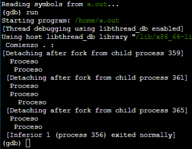
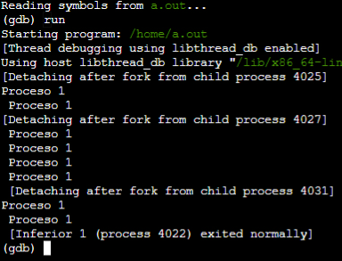
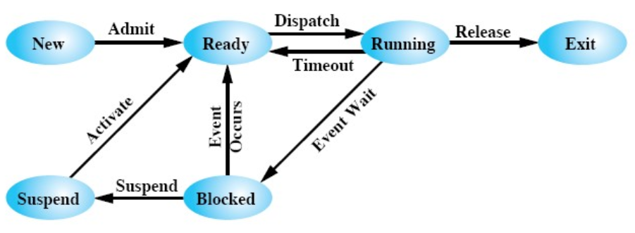
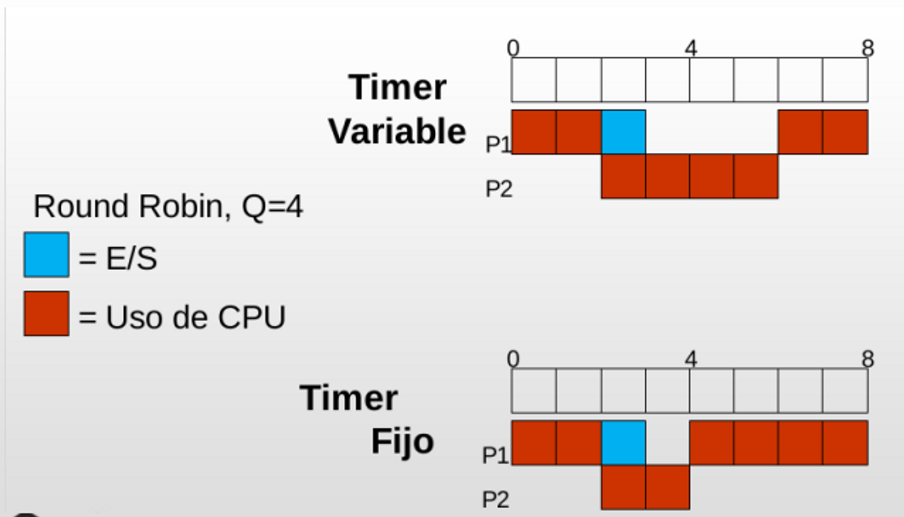

<h1 align="center"> 📕 Practica 4</h1>


<div align="center">

[Siguiente](/Documentos/Practica5.md)<br>
[Anterior](/Documentos/Practica3.md)

</div>


### **Objetivo**

El objetivo de esta práctica es que el alumno comprenda los aspectos base acerca de la planificación de procesos en un Sistema Operativo (tipos de planificadores, algoritmos y sus variantes, etc.). Además, para la autocorrección de los ejercicios, es deseable la utilización del simulador
que se encuentra en cátedras virtuales

---

- [Ejercicio 1 Responda en forma sintética sobre los siguientes conceptos](#1-responda-en-forma-sintética-sobre-los-siguientes-conceptos)
- [Ejercicio 2 Procesos](#2procesos)
- [Ejercicio 3 Para los siguientes algoritmos de scheduling](#3-para-los-siguientes-algoritmos-de-scheduling)
- [Ejercicio 4 Para el algoritmo Round Robin, existen 2 variantes](#4-para-el-algoritmo-round-robin-existen-2-variantes)
- [Ejercicio 5 Se tiene el siguiente lote de procesos que arriban al sistema en el instante 0 (cero)](#5-se-tiene-el-siguiente-lote-de-procesos-que-arriban-al-sistema-en-el-instante-0-cero)
- [Ejercicio 6 Se tiene el siguiente lote de procesos](#6-se-tiene-el-siguiente-lote-de-procesos)
- [Ejercicio 7 Una variante al algoritmo SJF es el algoritmo SJF apropiativo o SRTF](#7-una-variante-al-algoritmo-sjf-es-el-algoritmo-sjf-apropiativo-o-srtf-shortest-remaining-time-first)
- [Ejercicio 8 Suponga que se agregan las siguientes prioridades al lote de procesos](#8-suponga-que-se-agregan-las-siguientes-prioridades-al-lote-de-procesos-del-ejercicio-6-donde-un-menor-número-indica-mayor-prioridad)
- [Ejercicio 9 Inanición (Starvation)](#9-inanición-starvation)
- [Ejercicio 10 Los procesos, durante su ciclo de vida, pueden realizar operaciones de I/O ](#10-los-procesos-durante-su-ciclo-de-vida-pueden-realizar-operaciones-de-io-como-lecturas-o-escrituras-a-disco-cintas-uso-de-impresoras-etc)
- [Ejercicio 11 Algunos algoritmos pueden presentar ciertas desventajas cuando en el sistema](#11-algunos-algoritmos-pueden-presentar-ciertas-desventajas-cuando-en-el-sistema-se-cuenta-con-procesos-ligados-a-cpu-y-procesos-ligados-a-entrada-salida-analice-las-mismas-para-los-siguientes-algoritmos)
- [Ejercicio 12 Para equiparar la desventaja planteada en el ejercicio 11)](#12-para-equiparar-la-desventaja-planteada-en-el-ejercicio-11-se-plantea-la-siguiente-modificación-al-algoritmo)
- [Ejercicio 13 ](#ejercicio-13)
- [Ejercicio 14 ](#ejercicio-14)
- [Ejercicio 15 Colas Multinivel](#15-colas-multinivel)
- [Ejercicio 16 ](#ejercicio-16)
- [Ejercicio 17 ](#ejercicio-17)
- [Ejercicio 18 La situación planteada en el ejercicio 17, donde un proceso puede cambiar](#18-la-situación-planteada-en-el-ejercicio-17-donde-un-proceso-puede-cambiar-de-una-cola-a-otra-se-la-conoce-como-colas-multinivel-con-realimentación)
- [Ejercicio 19 Un caso real: “Unix Clasico “ (SVR3 y BSD 4.3)](#19-un-caso-real-unix-clasico--svr3-y-bsd-43)
- [Ejercicio 20 A cuáles de los siguientes tipos de trabajos:](#20-a-cuáles-de-los-siguientes-tipos-de-trabajos)
- [Ejercicio 21 Explicar porqué si el quantum "q.en Round-Robin se incrementa sin límite](#21-explicar-porqué-si-el-quantum-qen-round-robin-se-incrementa-sin-límite-el-método-se-aproxima-a-fifo)
- [Ejercicio 22 Los sistemas multiprocesador pueden clasificarse en](#22-los-sistemas-multiprocesador-pueden-clasificarse-en)
- [Ejercicio 23 Asumiendo el caso de procesadores homogéneos](#23-asumiendo-el-caso-de-procesadores-homogéneos)
- [Ejercicio 24 Indique brevemente a que hacen referencia los siguientes conceptos](#24-indique-brevemente-a-que-hacen-referencia-los-siguientes-conceptos)
- [Ejercicio 25 Si a la tabla del ejercicio 6 la modificamos de la siguiente manera](#25-si-a-la-tabla-del-ejercicio-6-la-modificamos-de-la-siguiente-manera-y-considerando-que-el)


## 1. Responda en forma sintética sobre los siguientes conceptos:

#### **`(a)`** Programa y Proceso

- **Programa**: Estático, sin PC, existe desde que se edita hasta que se borra.
- **Proceso**: Dinámico, con PC, vive desde que se lo ejecuta hasta que termina su ejecución.


---

#### **`(b)`** Defina Tiempo de retorno (TR) y Tiempo de espera (TE) para un Job.

**Tiempo de Retorno (TR):** Tiempo transcurrido entre que un proceso llega al sistema y la finalización de su ejecución.

**Tiempo de Espera (TE)**: Tiempo dentro de TR en el que el proceso se encuentra esperando (fuera de ejecución). Se puede definir como *TE = (TR - Tcpu)*.

---

#### **`(c)`** Defina Tiempo Promedio de Retorno (TPR) y Tiempo promedio de espera (TPE) para un lote de JOBS.

**Tiempo Promedio de Retorno (TPR)**: Es el promedio de todos los TR en un conjunto de procesos, se vería como sum(TR)/cantP

**Tiempo Promedio de Espera (TPE):**  Es el promedio de todos los TE en un conjunto de procesos, se vería como sum(TE)/cantP

> Tratamos en estos casos con conjuntos de procesos, no con un sólo proceso como en TE y TR

---

#### **`(d)`** ¿Qué es el Quantum?

Quantum: Utilizado en el algoritmo de scheduling Round Robin (RR), es una medida que determina cuánto tiempo puede usar la CPU cada proceso.

---

#### **`(e)`** ¿Qué significa que un algoritmo de scheduling sea apropiativo o no apropiativo?

**Apropiativo (Preemptive)**: Un proceso en ejecución puede ser interrumpido y llevado a la cola de listos.

**No Apropiativo (Non-Preemptive)**: Una vez que un proceso ingresa a ejecución, continúa hasta que termina o se bloquea por algún evento (I/O, orden del SO, etc…)

---

#### **`(f)`** ¿Qué tareas realizan?:

i. **Short Term Scheduler**: Determina qué proceso pasa a ejecutarse. 

ii. **Long Term Scheduler**: Admite nuevos procesos a memoria, controlando el grado de multiprogramación.

iii. **Medium Term Scheduler**: Realiza el swapping entre disco y memoria cuando el SO lo determina, puede disminuír el grado de multiprogramación.

---

#### **`(g)`** ¿Qué tareas realiza el Dispatcher?

Dispatcher: Módulo que otorga control de la CPU al proceso seleccionado por el short term scheduler. Es independiente del scheduler y no tiene algoritmo específico para su implementacion. Se encarga del Context switch, cambio a modo usuario y salto a la instrucción adecuada en la vuelta de un proceso.

---


## 2.Procesos

#### `a)` Investigue y detalle para que sirve cada uno de los siguientes comandos. (Puede que algún comando no venga por defecto en su distribución por lo que deberá instalarlo)
- `top` Muestra información en tiempo real sobre los procesos en ejecución y su consumo de recursos.
- `htop` Versión mejorada de top con una interfaz más amigable y colorida para monitorear y administrar procesos.
- `ps` Muestra una instantánea de los procesos en ejecución en el sistema.
- `pstree` Muestra una representación jerárquica de los procesos en ejecución en forma de árbol.
- `kill`  Envía una señal a un proceso para solicitar su terminación.
- `pgrep, pkill, killall` Herramientas para buscar y terminar procesos por su nombre o características.
- `renice` Cambia la prioridad de ejecución de un proceso en ejecución.
- `xkill` Proporciona una interfaz gráfica para terminar aplicaciones en entornos gráficos.
- `atop` Herramienta avanzada de monitoreo del sistema que proporciona información detallada sobre el rendimiento del sistema.

Algunos de estos comandos pueden requerir instalación adicional en tu distribución de Linux.

---

#### `b)` Observe detenidamente el siguiente código. Intente entender lo que hace sin necesidad de ejecutarlo. 
<table><td>

```c
#include <stdio.h>
#include <sys/types.h>
#include <unistd.h>
int main ( void ) {
    int c;
    pid_t pid;
    printf (" Comienzo . : \n " ) ;
    for ( c = 0; c < 3 ; c++ ){
        pid = fork ( ) ;
        }
    printf(" Proceso \n " ) ;
    return 0;
}
```

</td><td>



</td>
</table>

#### i. ¿Cuántas líneas con la palabra “Proceso” aparecen al final de la ejecución de este programa?. Tengo dudas aca ⚠️

El número de líneas con la palabra "Proceso" al final de la ejecución de este programa depende del número de veces que se haya ejecutado la función fork() en el bucle for. En este caso, el bucle for se ejecuta tres veces, lo que significa que se crearán tres procesos hijos. Por lo tanto, se imprimirá la línea "Proceso" una vez por cada proceso hijo creado.

#### ii. ¿El número de líneas es el número de procesos que han estado en ejecución?.

El número de líneas con la palabra "Proceso" al final de la ejecución del programa no es necesariamente igual al número de procesos que han estado en ejecución. Cada vez que se llama a la función fork(), se crea un nuevo proceso hijo, pero no significa que todos los procesos estén en ejecución simultáneamente. Los procesos pueden ejecutarse en diferentes momentos y en diferentes órdenes, dependiendo del sistema operativo y la planificación de procesos.

- [El codigo se puede testear aca](https://www.onlinegdb.com/online_c_compiler)

---

#### `c)` Vamos a tomar una variante del programa anterior. Ahora, además de un mensaje, vamos a añadir una variable y, al final del programa vamos a mostrar su valor. El nuevo código del programa se muestra a continuación. 

<table><td>

```c
#include <stdio.h>
#include <sys/types.h>
#include <unistd.h>
int main ( void ) {
    int c ;
    int p=0;
    pid_t pid ;
    for ( c = 0; c < 3 ; c++ ){
        pid = fork ( ) ;
    }
    p++;
    printf (" Proceso %d \n " , p ) ;
    return 0;
}
```

</td><td>



</td></table>


#### i. ¿Qué valores se muestran por consola?. ⚠️⚠️

Es un 1 por cada proceso 

#### ii. ¿Todas las líneas tendrán el mismo valor o algunas líneas tendrán valores distin- tos?.

Todas tendrán el mismo, ya que no se hace fork luego de modificar p

#### iii. ¿Cuál es el valor (o valores) que aparece?. Ejecute el programa y compruebe si su respuesta es correcta, Modifique el valor del bucle for y el lugar dónde se incrementa la variable p y compruebe los nuevos resultados.

Siempre será 1, sin importar c

---

#### `(d)` Comunicación entre procesos
#### i. Investigue la forma de comunicación entre procesos a través de pipes.

```c
// C program to demonstrate use of fork() and pipe()
#include <stdio.h>
#include <stdlib.h>
#include <string.h>
#include <sys/types.h>
#include <sys/wait.h>
#include <unistd.h>
 
int main()
{
    // We use two pipes
    // First pipe to send input string from parent
    // Second pipe to send concatenated string from child
 
    int fd1[2]; // Used to store two ends of first pipe
    int fd2[2]; // Used to store two ends of second pipe
 
    char fixed_str[] = "forgeeks.org";
    char input_str[100];
    pid_t p;
 
    if (pipe(fd1) == -1) {
        fprintf(stderr, "Pipe Failed");
        return 1;
    }
    if (pipe(fd2) == -1) {
        fprintf(stderr, "Pipe Failed");
        return 1;
    }
 
    scanf("%s", input_str);
    p = fork();
 
    if (p < 0) {
        fprintf(stderr, "fork Failed");
        return 1;
    }
 
    // Parent process
    else if (p > 0) {
        char concat_str[100];
 
        close(fd1[0]); // Close reading end of first pipe
 
        // Write input string and close writing end of first
        // pipe.
        write(fd1[1], input_str, strlen(input_str) + 1);
        close(fd1[1]);
 
        // Wait for child to send a string
        wait(NULL);
 
        close(fd2[1]); // Close writing end of second pipe
 
        // Read string from child, print it and close
        // reading end.
        read(fd2[0], concat_str, 100);
        printf("Concatenated string %s\n", concat_str);
        close(fd2[0]);
    }
 
    // child process
    else {
        close(fd1[1]); // Close writing end of first pipe
 
        // Read a string using first pipe
        char concat_str[100];
        read(fd1[0], concat_str, 100);
 
        // Concatenate a fixed string with it
        int k = strlen(concat_str);
        int i;
        for (i = 0; i < strlen(fixed_str); i++)
            concat_str[k++] = fixed_str[i];
 
        concat_str[k] = '\0'; // string ends with '\0'
 
        // Close both reading ends
        close(fd1[0]);
        close(fd2[0]);
 
        // Write concatenated string and close writing end
        write(fd2[1], concat_str, strlen(concat_str) + 1);
        close(fd2[1]);
 
        exit(0);
    }
}
```


#### ii. ¿Cómo se crea un pipe en C?.

- pipe(int fd[2]) → Creamos un pipe que va a usar **`fd[0]`** para el reading end y **`fd[1]`** para writing end 
- Para usarlo uno de los lados, vamos a tener que cerrar el otro (con **`close(fd[X])`**)
- No se puede reabrir un end
- El close se hace para marcar EOF en la comunicación por medio de ese end y permitir que la comunicación por ese medio finalice (caso contrario no termina nunca)

#### iii. ¿Qué parametro es necesario para la creación de un pipe?. Explique para que se utiliza.

Un arreglo de enteros con 2 posiciones, el cual controlará el estado open/closed de cada lado (r/w) del pipe.

#### iv. ¿Qué tipo de comunicación es posible con pipes?

- Puede comunicar procesos en modo lectura o escritura
- write(fd[1], String1, **strlen**(String1) + 1)
- read(fd[0], String1, **strlen**(String1) + 1)

---

#### `(e)` ¿Cuál es la información mínima que el SO debe tener sobre un proceso?¿En que es- tructura de datos asociada almacena dicha información?

- PID, PPID, Estado, Prioridad, PC, Registros de CPU, Estado de E/S, Datos de Contexto y Datos de Accounting.
- Se guardan en la PCB

---

#### `(f)` ¿Qué significa que un proceso sea “CPU Bound” y “I/O Bound”?

- Los procesos CPU Bound son los que utilizan mayormente CPU, no mucha E/S, necesitan un TR rápido
- Los procesos I/O Bound son los que utilizan mayormente E/S, necesitan una respuesta rápida a la E/S

---

#### `(g)` ¿Cuáles son los estados posibles por los que puede atravesar un proceso?

Puede pasar por New, Ready, Ready/Suspend, Executing, Waiting, Blocked, Blocked/Suspend,Exit

---

#### `(h)` Explique mediante un diagrama las posibles transiciones entre los estados.



---

#### `(i)` ¿Que scheduler de los mencionados en 1 f se encarga de las transiciones?

El Medium Term Scheduler.


### 3. Para los siguientes algoritmos de scheduling:

- FCFS (Fisrt Coome First Served)
- SJF (Shortest Job First)
- Round Robin
- Prioridades

***Realice***

---

#### `(a)` Explique su funcionamiento mediante un ejemplo.

#### FCFS (Fisrt Coome First Served)

- Marcamos las llegadas
- En el instante 0 lo unico que pasa es que llega el proceso 1
- Como no es apropiativo, se va a ejecutar hasta que termine
- Cuando termino de ejecutarse el proceso 1, ya se encolaron todos los otros procesos


---

#### SJF (Shortest Job First)

- La prioridad no la usamos
- Lo ideal primero es marcar las llegadas
- Despues vamos pensando que es lo que pasa en cada instante de tiempo. 

Por ejemplo, en el instante `0` llega el proceso 1, lo encolamos, lo voy a seleccionar ya que es el unico que esta en la cola y como no es apropiativo ejecuto los 9 tiempos del cpu.

- Como ya se encolaron todos cuando se termino de ejecutar el proceso 1, elijo el que tiene la siguiente rafaga de cpu mas corta. 
- Se ejecuta el proceso 3, despues el 2 y por ultimo el 4.
- El TR, es el tiempo que llega a la cola de listos, hasta que termina completamente
- Es el tiempo que tuvo que esperar el proceso, antes de que se le asigne CPU
o con la formula de `TR - CPU`


---

#### Round Robin

Este tiene timer variable

- Marcamos las llegadas de todos los procesos
- Nos detenemos en cada quantum
- En el isntante 0, se encola el proceso 1 en la cola de listos
- Pasa a estado runing y este se ejecuta al menos 4 veces
- A medida que el proceso se ejecuto, se encolaron los demas procesos.
- Cuando sale del estado de runig y vuelve al estado de listo, se vuelve a encolar
- Como no tenemos nada que se este ejecutando, vamos a la cola y esta al tener un clock, vamos por orden de llegada, y volvemos a hacer lo mismo con el proceso 2
- Como es un RR de tiempo variable, no nos cambia nada que el proceso 3 haya ejecutado 3 tiempo y no 4


---

#### Prioridades

- Por cada prioridad distinta, genero una cola nueva
- Marcamos las llegadas como siempre
- En el momento 0 va a llegar el proceso 1 con cpu 9 y prioridad 3
- En general se descencolar se descencolan de las colas superiories hacia abajo (Si tienen algun proceso, en caso contrario continua con la siguiente cola). Primero la cola 1, despues la 2 y por ultimo la 3. En caso de que los procesos tengan la misma prioridad, se descencolan por orden de llegada
- El algoritmo es apropiativo, esto quiere decir que si durante la ejecución del proceso 1, entra otro con mayor prioridad, se va a sacar y vuelve a la cola de listos
- Cuando el proceso no termino de cpu, enconces se vuelve a encolar en su respectiva cola.


---

#### `(b)` ¿Alguno de ellos requiere algún parámetro para su funcionamiento?

RR requiere recibir el valor del Quantum asignado

---

#### `(c)` Cual es el mas adecuado según los tipos de procesos y/o SO.

**FCFS (Fisrt Come First Served/FIFO)** → No beneficia a ninguno, CPU Bound terminan en primera ráfaga, I/O bound no.

**SJF (Shortest Job First)** → No favorece a ninguno en particular, funciona similar a FIFO, puede causar starvation y afectar los tiempos de respuesta.

**Round Robin** → Favorece I/O Bound.

**Prioridades** → No favorece a ninguno en particular, si tuviéramos alta prioridad para CPU Bound, se ejecutarían ellos; si fuera para I/O Bound se ejecutarian ellos; si tuviéramos prioridades diferentes para diferentes procesos en particular, también podría personalizarse.

**SRTF (Shortest Remaining Time First)** → Favorece I/O Boud.

**Colas Multinivel** → No favorece a ninguno en particular, puede personalizarse para hacerlo.

**VRR (Virtual Round Robin)** → Favorece a I/O Bound y tiene un tiempo de respuesta muy bueno. Busca de todas formas un sistema balanceado.

---

#### `(d)` Cite ventajas y desventajas de su uso

**FCFS (Fisrt Come First Served / FIFO)** → Es el más simple, no lleva mucha lógica ni costos, pero limita mucho la capacidad de decisión sobre la planificación. No produce inanición ni tiene procesos beneficiados.

**SJF (Shortest Job First)** → Es también simple, tampoco lleva mucha lógica o costos (aunque mayores que FIFO), puede causar starvation.

**Round Robin** → Conserva cierta simplicidad, beneficia I/O, no puede causar starvation. Posee variantes (TF/TV).

**Prioridades** → Puede causar starvation, aumenta la libertad de seleccion de procesos beneficiados. Puede causar starvation, pero con diferentes políticas (como aging/penalty o burbujeo).


### 4. Para el algoritmo Round Robin, existen 2 variantes:

- Timer Fijo
- Timer Variable

***Realice***

#### `(a)` ¿Qué significan estas 2 variantes?

**Timer Fijo** El contador del Q no se modifica, cada Q tiempos de CPU el STS seleccionará un nuevo proceso.

**Timer Variable** El contador del Q se reinicia cada vez que entra un proceso nuevo a la CPU.

---

####  `(b)` Explique mediante un ejemplo sus diferencias.



---

####  `(c)` En cada variante ¿Dónde debería residir la información del Quantum?

**Timer Fijo** Variable global del Algoritmo.

**Timer Variable** Variable local del proceso.


### 5. Se tiene el siguiente lote de procesos que arriban al sistema en el instante 0 (cero):

| Job | Unidades de CPU |
| --- | --- |
| 1 | 7 |
| 2 | 15 |
| 3 | 12 |
| 4 | 4 |
| 5 | 9 |

- `(a)` Realice los diagramas de Gantt según los siguientes algoritmos de scheduling:
#### i. FCFS (First Come, First Served)


---

#### ii. SJF (Shortest Job First)


---

#### iii. Round Robin con quantum = 4 y Timer Fijo


---

#### iv. Round Robin con quantum = 4 y Timer Variable


---

- `(b)` Para cada algoritmo calcule el TR y TE para cada job así como el TPR y el TPE.
- `(c)` En base a los tiempos calculados compare los diferentes algoritmos.


### 6. Se tiene el siguiente lote de procesos

#### `(a)` Realice los diagramas de Gantt según los siguientes algoritmos de scheduling:

| Job | Llegada | Unidades de CPU |
| --- | --- | --- |
| 1 | 0 | 4 |
| 2 | 2 | 6 |
| 3 | 3 | 4 |
| 4 | 6 | 5 |
| 5 | 8 | 2 |

#### i. FCFS (First Come, First Served)

| Job | Llegada | CPU | Te | Tr |
| --- | ------- | --- | -- | -- |
| 1   | 0       | 4   | 0  | 4  |
| 2   | 2       | 6   | 2  | 8  |
| 3   | 3       | 4   | 7  | 11 |
| 4   | 6       | 5   | 8  | 13 |
| 5   | 8       | 2   | 11 | 13 |


---

#### ii. SJF (Shortest Job First)


---

#### iii. Round Robin con quantum = 1 y Timer Variable


---

#### iv. Round Robin con quantum = 6 y Timer Variable


Recien me doy cuenta que me olvide de restar el tiempo de llegada en los tiempos de retorno


### 7. Una variante al algoritmo SJF es el algoritmo SJF apropiativo o SRTF (Shortest Remaining Time First):
####  `(a)` Realice el diagrama del Gantt para este algoritmo según el lote de trabajos del ejercicio 6.


####  `(b)` ¿Nota alguna ventaja frente a otros algoritmos?

El TPR es considerablemente alto (el más alto de todos), mientras que el TPE es el bastante mejor (el más bajo de todos). Tiene esa ventaja al parecer, El tiempo de respuesta puede ser promedio, no parece beneficiar a I/O ni a CPU Bound.

#### Ejemplo de SRTF 

Se selecciona el siguiente proceso, cuya siguiente rafaga de CPU, sea la mas corta entre todos los que esten encolados en la cola de listos. Es la version apropiativa del SJF. 
- Primero marcamos las llegadas
- Cuando llega el proceso 1 en el instante cero, lo encolamos, cuando se ejecute el proceso 1, en el instante 0, va a tener 8 de cpu
- En el tiempo 1, ingresa el proceso 2 que tiene 5 de cpu, que es menor al proceso1 que tiene 8 de cpu, este queda con 4 de cpu
- En el tiempo 2, pasa lo mismo, ya que el proceso3 tiene 3 de cpu y el proceso2 se queda con 4, y este se ejecuta completo ya que no va a encontrar otro con menor rafaga de cpu que ese.
- Tachamos el proceso 3 ya que termino y buscamos entre los restantes, cual es que tiene menor tiempo de cpu 
- Entonces al proceso 1 = 8 de CPU, al proceso 2 = 4 de CPU y al proceso 4 = 7 de CPU
- Ejecutamos por completo el proceso 2
- Ejecutamos por completo el proceso 4 que tiene 6 de CPU
- Y por ultimo vamos a ejecutar el proceso 1 hasta el final


### 8. Suponga que se agregan las siguientes prioridades al lote de procesos del ejercicio 6, donde un menor número indica mayor prioridad:


| Job | Prioridad |
| --- | --- |
| 1 | 3 |
| 2 | 4 |
| 3 | 2 |
| 4 | 1 |
| 5 | 2 |

`(a)` Realice el diagrama de Gantt correspondiente al algoritmo de planificación por prioridades según las variantes:

#### i. No Apropiativa


---

#### ii. Apropiativa

---

- `(b)` Calcule el TR y TE para cada job así como el TPR y el TPE.
- `(c)` ¿Nota alguna ventaja frente a otros algoritmos? Bajo que circunstancias lo utilizaría y ante que situaciones considera que la implementación de prioridades podría no ser de mayor relevancia?


### 9. Inanición (Starvation)
#### `(a)` ¿Qué significa?

Se da cuando un proceso queda ocioso de uso de la CPU, ya que otros la ocupan previamente de forma constante y no le permiten hacer su uso. Es entonces el estado de un proceso que no está recibiendo tiempo de CPU por un lapso temporal prolongado.


#### `(b)` ¿Cuál/es de los algoritmos vistos puede provocarla?

SJF, Prioridades y SRTF

#### `(c)` ¿Existe alguna técnica que evite la inanición para el/los algoritmos mencionados en b?

Aging y la tácnica de “burbujeo” pueden evitarlo.
- **Aging**: penaliza a los procesos con mucho tiempo de CPU acumulado en su ciclo de vida.
- **Burbujeo**: sube la prioridad de los procesos que llevan mucho tiempo ociosos.


### 10. Los procesos, durante su ciclo de vida, pueden realizar operaciones de I/O como lecturas o escrituras a disco, cintas, uso de impresoras, etc.

El SO mantiene para cada dispositivo, que se tiene en el equipo, una cola de procesos que espera por la utilización del mismo (al igual que ocurre con la Cola de Listos y la CPU, ya que la CPU es un dispositivo mas).

Cuando un proceso en ejecución realiza una operación de I/O el mismo es expulsado de la CPU y colocado en la cola correspondiente a el dispositivo involucrado en la operación.

El SO dispone también de un “I/O Scheduling” que administrada cada cola de dispositivo a través de algún algoritmo (FCFS, Prioridades, etc.). Si al colocarse un proceso en la cola del dispositivo, la misma se encuentra vacía el mismo será atendido de manera inmediata, caso contrario, deberá esperar a que el SO lo seleccione según el algoritmo de scheduling establecido.

Los mecanismos de I/O utilizados hoy en día permiten que la CPU no sea utilizada durante la operación, por lo que el SO puede ejecutar otro proceso que se encuentre en espera una vez que el proceso bloqueado por la I/O se coloca en la cola correspondiente.

Cuando el proceso finaliza la operación de I/O el mismo retorna a la cola de listos para competir nuevamente por la utilización de la CPU.

Para los siguientes algoritmos de Scheduling:
- FCFS
- Round Robin con quantum = 2 y timer variable.

Y suponiendo que la cola de listos de todos los dispositivos se administra mediante FCFS, realice los diagramas de Gantt según las siguientes situaciones:

- `(a)` Suponga que al lote de procesos del ejercicio 6 se agregan las siguientes operaciones de entrada salida:
    | Job | I/O (rec,ins,dur) |
    | --- | --- |
    | 1 | (R1, 2, 1) |
    | 2 | (R2, 3, 1) (R2, 5, 2) |
    | 4 | (R3, 1, 2) (R3, 3, 1) |
- `(b)` Suponga que al lote de procesos del ejercicio 6 se agregan las siguientes operaciones de entrada salida
    | Job | I/O (rec,ins,dur) |
    | --- | --- |
    | 1 | (R1, 2, 3) (R1, 3, 2) |
    | 2 | (R2, 3, 2) |
    | 3 | (R2, 2, 3) |
    | 4 | (R1, 1, 2) |


### 11. Algunos algoritmos pueden presentar ciertas desventajas cuando en el sistema se cuenta con procesos ligados a CPU y procesos ligados a entrada salida. Analice las mismas para los siguientes algoritmos:

#### `(a)` Round Robin

Es casi ideal paraI I/O ound si establecemos un Q bajo (una cola larga puede afectar el tiempo de respuesta de un proceso). No beneficia a ninguno en particular, Q alto puede afectar tiempo de respuesta y Q bajo puede afectar eficiencia para CPU Bound. Suele utilizarse para I/O Bound.

---

#### `(b)` SRTF (Shortest Remaining Time First)

Puede llegar a afectar tiempos de respuesta y causar starvation. No es del todo malo para CPU Bound, y favorece a I/O bound, pero no llega a ser del todo apropiado para procesos interactivos.


### 12. Para equiparar la desventaja planteada en el ejercicio 11), se plantea la siguiente modificación al algoritmo:

**Algoritmo VRR** (Virtual Round Robin): Este algoritmo funciona igual que el Round Robin, con la diferencia que cuando un proceso regresa de una I/O se coloca en una cola auxiliar. Cuando se tiene que tomar el próximo proceso a ejecutar, los procesos que se encuentra en la cola auxiliar tienen prioridad sobre los otros. Cuando se elije un proceso de la cola auxiliar se le otorga el procesador por tantas unidades de tiempo como le falto ejecutar en su ráfaga de CPU anterior, esto es, se le otorga la CPU por un tiempo que surge entre la diferencia del quantum original y el tiempo usado en la última ráfaga de CPU.

- `(a)` Analice el funcionamiento de este algoritmo mediante un ejemplo. Marque en cada instante en que cola se encuentran los procesos.
- `(b)` Realice el ejercicio 10)a) nuevamente considerando este algoritmo, con un quantum de 2 unidades y Timer Variable.


### Ejercicio 13

Suponga que un SO utiliza un algoritmo de VRR con Timer Variable para el planificar sus procesos. Para ello, el quantum es representado por un contador, que es decrementado en 1 unidad cada vez que ocurre una interrupción de reloj. ¿Bajo este esquema, puede suceder que el quantum de un proceso nunca llegue a 0 (cero)? Justifique su respuesta.

Sí, poodría no ocurrir, si tuviéramos sólo procesos con tiempo de uso de CPU menor al Quantum asignado, entonces el contador nunca llegaría a 0. Fuera de ese caso no, ya que los procesos siempre vuelven de E/S a terminar su Quantum asignado, llegando este en algún momento a 0.


### Ejercicio 14

El algoritmo SJF (y SRTF) tiene como problema su implementación, dada la dificultad de conocer la duración de la próxima ráfaga de CPU. Es posible realizar una estimación de la próxima, utilizando la media de las ráfagas de CPU para cada proceso.

Así, por ejemplo, podemos tener la siguiente formula:


Donde:

- **`Ti`** = duración de la ráfaga de CPU i-ésima del proceso.
- **`Si`** = valor estimado para el i-ésimo caso
- **`Si`** = valor estimado para la primer ráfaga de CPU. No es calculado.

***Enunciados***

- **`(a)`** Suponga un proceso cuyas ráfagas de CPU reales tienen como duración: 6, 4, 6, 4, 13, 13, 13 Calcule que valores se obtendrían como estimación para las ráfagas de CPU del proceso si se utiliza la formula 1, con un valor inicial estimado de S1=10. La formula anterior 1 le da el mismo peso a todos los casos (siempre calcula la media). Es posible reescribir la formula permitiendo darle un peso mayor a los casos mas recientes y menor a casos viejos (o viceversa). Se plantea la siguiente formula: <br><br>

    Con 0 〈 α 〈 1.
- `(b)` Analice para que valores de α se tienen en cuenta los casos mas recientes.
    - Para valores de α mayores se da mayor importancia al caso real más reciente, y se da menor a los promedios anteriores, en la fórmula anterior era al revés, se dava importancia inversa, donde la importancia al más reciente perdía cada vez más porcentaje conforme la cantidad de ráfagas n aumente.
- `(c)` Para la situación planteada en a) calcule que valores se obtendrían si se utiliza la formula 2 con α = 0,2; α = 0,5 y α = 0,8.
- `(d)` Para todas las estimaciones realizadas en a y c ¿Cuál es la que mas se asemeja a las
ráfagas de CPU reales del proceso?


### 15. Colas Multinivel

Hoy en día los algoritmos de planificación vistos se han ido combinando para formar al- goritmos más eficientes. Así surge el algoritmo de Colas Multinivel, donde la cola de procesos listos es divida en varias colas, teniendo cada una su propio algoritmo de planificación.

- `(a)` Suponga que se tienen dos tipos de procesos: Interactivos y Batch. Cada uno de estos procesos se coloca en una cola según su tipo. ¿Qué algoritmo de los vistos utilizaría para administrar cada una de estas colas?.\ A su vez, se utiliza un algoritmo para administrar cada cola que se crea. Así, por ejemplo, el algoritmo podría determinar mediante prioridades sobre que cola elegir un proceso.
- `(b)` Para el caso de las dos colas vistas en a: ¿Qué algoritmo utilizaría para planificarlas?


### Ejercicio 16

Suponga que en un SO se utiliza un algoritmo de planificación de colas multinivel. El mismo cuenta con 3 colas de procesos listos, en las que los procesos se encolan en una u otra según su prioridad. Hay 3 prioridades (1 , 2 , 3), donde un menor número indica mayor prioridad.

Se utiliza el algoritmo de prioridades para la administración entre las colas. 

Se tiene el siguiente lote de procesos a ser procesados con sus respectivas operaciones de I/O:

| Job | Llegada | CPU | I/O (rec,ins,dur) | Prioridad |
| --- | --- | --- | --- | --- |
| 1 | 0 | 9 | (R1, 4, 2) (R2, 6, 3) (R1, 8, 3) | 1 |
| 2 | 1 | 5 | (R3, 3, 2) (R3, 4, 2) | 2 |
| 3 | 2 | 5 | (R1, 4, 1) | 3 |
| 4 | 3 | 7 | (R2, 1, 2) (R2, 5, 3) | 2 |
| 5 | 5 | 5 | (R1, 2, 3) (R3, 4, 3) | 1 |

Suponiendo que las colas de cada dispositivo se administran a trabes de FCFS y que cada cola de procesos listos se administra por medio de un algoritmo RR con un quantum de 3 unidades y Timer Variable, realice un diagrama de Gantt:

- `(a)` Asumiendo que NO hay apropiación entre los procesos.
- `(b)` Asumiendo que hay apropiación entre los procesos.


### Ejercicio 17

En el esquema de Colas Multinivel, cuando se utiliza un algoritmo de prioridades para administrar las diferentes colas los procesos pueden sufrir starvation.

La técnica de envejecimiento se puede aplicar a este esquema, haciendo que un proceso cambie de una cola de menor prioridad a una de mayor prioridad, después de cierto periodo de tiempo que el mismo se encuentra esperando en su cola. Luego de llegar a una cola en la que el proceso llega a ser atendido, el mismo retorna a su cola original.

Por ejemplo: Un proceso con prioridad 3 esta en cola su cola correspondiente. Luego de X unidades de tiempo, el proceso se mueve a la cola de prioridad 2. Si en esta cola es atendido, retorna a su cola original, en caso contrario luego de sucederse otras X unidades de tiempo el proceso de mueve a la cola de prioridad 1. Esta última acción se repite hasta que el proceso obtiene la CPU, situación que hace que el mismo vuelva a su cola original.

- `(a)` Para los casos a y b del ejercicio 16 realice el diagrama de Gantt considerando además que se tiene un envejecimiento de 4 unidades.


### 18. La situación planteada en el ejercicio 17, donde un proceso puede cambiar de una cola a otra, se la conoce como Colas Multinivel con Realimentación.

Suponga que se quiere implementar un algoritmo de planificación que tenga en cuenta el tiempo de ejecución consumido por el proceso, penalizando a los que más tiempo de ejecución tienen. (Similar a la tarea del algoritmo SJF que tiene en cuenta el tiempo de ejecución que resta).

Utilizando los conceptos vistos de Colas Multinivel con Realimentación indique que colas implementaría, que algoritmo usaría para cada una de ellas así como para la administración de las colas entre sí.

Tenga en cuenta que los procesos no deben sufrir inanición.


### 19. Un caso real: “Unix Clasico “ (SVR3 y BSD 4.3)

Estos sistemas estaban dirigidos principalmente a entornos interactivos de tiempo compartido. El algoritmo de planificación estaba diseñado para ofrecer buen tiempo de respuesta a usuarios interactivos y asegurar que los trabajos de menor prioridad (en segundo plano) no sufrieran inanición.

La planificación tradicional usaba el concepto de colas multinivel con realimentación, utilizando RR para cada uno de las colas y realizando el cambio de proceso cada un segundo (quantum). La prioridad de cada proceso se calcula en función de la clase de proceso y de su historial de ejecución. Para ello se aplican las siguientes funciones:


donde:

- CPUj (i) = Media de la utilización de la CPU del proceso j en el intervalo i.
- Pj (i) = Prioridad del proceso j al principio del intervalo i (los valores inferiores indican prioridad más alta).
- Basej = Prioridad base del proceso j.
- Nicej = Factor de ajuste.

La prioridad del proceso se calcula cada segundo y se toma una nueva decisión de planificación. El propósito de la prioridad base es dividir los procesos en bandas fijas de prioridad. Los valores de CPU y nice están restringidos para impedir que un proceso salga de la banda que tiene asignada. Las bandas definidas, en orden decreciente de prioridad, son:

- Intercambio
- Control de Dispositivos de I/O por bloques
- Gestión de archivos
- Control de Dispositivos de I/O de caracteres
- Procesos de usuarios

Veamos un ejemplo: Supongamos 3 procesos creados en el mismo instante y con prioridad base 60 y un valor nice de 0. El reloj interrumpe al sistema 60 veces por segundo e incrementa un contador para el proceso en ejecución.

Los sectores en celeste representan el proceso en ejecución

(a) Analizando la jerarquía descripta para las bandas de prioridades: ¿Que tipo de acti-
vidad considera que tendrá más prioridad? ¿Por qué piensa que el scheduler prioriza
estas actividades?
(b) Para el caso de los procesos de usuarios, y analizando las funciones antes descriptas: \
¿Qué tipo de procesos se encarga de penalizar? (o equivalentemente se favorecen). Justifique
(c) La utilización de RR dentro de cada cola: ¿Verdaderamente favorece al sistema de
Tiempo Compartido? Justifique.


### 20. A cuáles de los siguientes tipos de trabajos:
- `(a)` cortos acotados por CPU
- `(b)` cortos acotados por E/S
- `(c)` largos acotados por CPU
- `(d)` largos acotados por E/S

benefician las siguientes estrategias de administración:

- `(a)` prioridad determinada estáticamente con el método del más corto primero (SJF).
- `(b)` prioridad dinámica inversamente proporcional al tiempo transcurrido desde la última operación de E/S


### 21. Explicar porqué si el quantum "q.en Round-Robin se incrementa sin límite, el método se aproxima a FIFO


### 22. Los sistemas multiprocesador pueden clasificarse en:

- **`Homogéneos:`** Los procesadores son iguales. Ningún procesador tiene ventaja física sobre el resto.
- **`Heterogéneos:`** Cada procesador tiene su propia cola y algoritmo de planificación.

Otra clasificación posible puede ser:

- **`Multiprocesador`** débilmente acoplados: Cada procesador tiene su propia memo- ria principal y canales.
- **`Procesadores`** especializados: Existe uno o más procesadores principales de propó- sito general y varios especializados controlados por el primero (ejemplo procesadores de E/S, procesadores Java, procesadores Criptográficos, etc.).
- **`Multiprocesador`** fuertemente acoplado: Consta de un conjunto de procesadores que comparten una memoria principal y se encuentran bajo el control de un Sistema Operativo

***Preguntas*** 

- **`(a)`** ¿Con cuál/es de estas clasificaciones asocia a las PCs de escritorio habituales?
- **`(b)`** ¿Qué significa que la asignación de procesos se realice de manera simétrica?
- **`(c)`** ¿Qué significa que se trabaje bajo un esquema Maestro/esclavo?


### 23. Asumiendo el caso de procesadores homogéneos

- **`(a)`** ¿Cuál sería el método de planificación más sencillo para asignar CPUs a los procesos?
- **`(b)`** Cite ventajas y desventajas del método escogido


### 24. Indique brevemente a que hacen referencia los siguientes conceptos

- **`(a)`** Huella de un proceso en un procesador
- **`(b)`** Afinidad con un procesador
- **`(c)`** ¿Por qué podría ser mejor en algunos casos que un proceso se ejecute en el mismo procesador?
- **`(d)`** ¿Puede el usuario en Windows cambiar la afinidad de un proceso? ¿y en GNU/Linux?
- **`(e)`** Investigue el concepto de balanceo de carga (load balancing).
- **`(f)`** Compare los conceptos de afinidad y balanceo de carga y como uno afecta al otro.


### 25. Si a la tabla del ejercicio 6 la modificamos de la siguiente manera: Y considerando que el

| Job | Llegada | CPU | Afinidad |
| --- | --- | --- | --- |
| 1 | 0 | 4 | CPU0 |
| 2 | 2 | 6 | CPU0 |
| 3 | 3 | 4 | CPU1 |
| 4 | 6 | 5 | CPU1 |
| 5 | 8 | 2 | CPU0 |

scheduler de los Sistemas Operativos de la familia Windows utiliza un mecanismo denomi-
nado preferred processor (procesador preferido). El scheduler usa el procesador preferido a
modo de afinidad cuando el proceso esta en estado ready. De esta manera el sheduler asigna
este procesador a la tarea si este está libre.

- **`(a)`** Ejecute el esquema anterior utilizando el algoritmo anterior.
- **`(b)`** Ejecute el esquema anterior. Pero ahora si el procesador preferido no está libre es asignado a otro procesador. Luego el procesador preferido de cada job es el último enel cual ejecuto.
- **`(c)`** Para cada uno de los casos calcule el tiempo promedio de retorno y el tiempo promedio de espera.
- **`(d)`** ¿Cuál de las dos alternativas planteadas es mas performante?


