<h1 align="center"> 🐧 Resumen Teorico</h1>

---

# Sistemas Operativos

- [Sistema Operativo](#sistema-operativo)
- [Funciones principales](#funciones-principales)
- [Problemas que debe evitar](#problemas-que-debe-evitar-un-so)
- [Componentes](#componentes)
  - [Kernel (Núcleo)](#kernel-nucleo)
    - [Monolítico](#monolitico)
    - [Microkernel](#microkernel)
    - [Monolítico Vs. Microkernel](#monolitico-vs-microkernel)
- [Servicios](#servicios)
  - [Apoyo del Hardware](#apoyo-del-hardware)
  - [Modos de ejecución](#modos-de-ejecución)
  - [Protección](#protecciones)
    - [Protección de la memoria](#protección-de-la-memoria)
    - [Protección de la E/S](#protección-de-la-es)
    - [Protección de la CPU](#protección-de-la-cpu)
  - [System Calls](#system-calls)
- [Elementos Básicos de una computadora](#elementos-basicos-de-una-computadora)
  - [Registros del Procesador](#registros-del-procesador)
    - [Visibles por el usuario](#visibles-por-el-usuario)
    - [De Control y Estado](#de-control-y-estado)
    - [Ciclo de Instrucciones](#ciclo-de-instrucción)
  - [Interrupciones](#interrupciones)
  - [Sistema Batch](#sistema-batch)
  - [Multiprogramación](#multiprogramación)

# Procesos


---


## Sistema Operativo
- Es software
  - Necesita un procesador y memoria para ejecutarse
- Dos Perspectivas
  - De arriba hacia abajo
  - De abajo hacia arriba
- Gestiona el HW
- Controla la ejecución de los procesos
- Interfaz entre aplicaciones y HW
- Actúa como intermediario entre un usuario de una computadora y el HW de la misma

### Perspectiva de arriba hacia abajo
- Abstracción con respecto a la arquitectura
  - **Arquitectura** conjunto de instrucciones, organización de memoria, E/S, estructura de bus
- El SO **oculta** el HW y presenta a los programas como abstracciones más simples de manejar.
- Los programas de aplicación son los **clientes** del SO.
- **Comparación**: uso de escritorio y uso de comandos de texto
- Comodidad, **amigabilidad** (friendliness)

### Perspectiva de Abajo hacia arriaba
- Visión del SO como un administrador de recursos
- Administra los recursos de HW de uno o más procesos
- Provee un conjunto de servicios a los usuarios del sistema
- Maneja la memoria secundaria y dispositivos de I/O.
- Ejecución simultánea de procesos
- Multiplexación en tiempo (CPU) y en espacio (memoria)

### Objetivos 
- **Comodidad** Hacer mas fácil el uso del hardware (PC, servidor, switch, router, controlador específico)
- **Eficiencia** Hacer un uso más eficiente de los recursos del sistema
- **Evolución** Permitir la introducción de nuevas funciones al sistema sin interferir con funciones anteriores

---

## Funciones principales
- Brindar abstracciones de alto nivel a  los procesos de usuario
- Administrar eficientemente el uso de  la CPU
- Administrar eficientemente el uso de la memoria
- Brindar asistencia al proceso de E/S por parte de los procesos

## Problemas que debe evitar un so

- Que un proceso se apropie de la CPU
- Que un proceso intente ejecutar instrucciones privilegiadas (Ej: E/S)
- Que un proceso intente acceder a una posición de memoria fuera de su espacio permitido.
  - Proteger los espacios de direcciones

Para ello debe

- Gestionar/controlar el uso de la CPU
- Detectar intentos de ejecución de instrucciones privilegiadas
- Detectar accesos ilegales a memoria
- Proteger el vector de interrupciones
  - Así como las RAI (Rutinas de atención de interrupciones)


---

## Componentes
- **Kernel**
- **Shell** GUI / CUI o CLI
- **Herramientas** Editores, Compiladores, Librerías, etc.

---

### Kernel (Nucleo)

Es una **`Porción de código`** que se encuentra en memoria principal y se encarga de la administración de los recursos

Implementa servicios esenciales:
- Manejo de memoria 
- Manejo de la CPU
- Administración de procesos
- Comunicación y Concurrencia
- Gestión de la E/S

Sobre el Kernel del Sistema Operativo

- Es un conjunto de módulos de software
- Se ejecuta en el procesador como cualquier otro proceso
- Entonces: 
  - ¿El kernel es un proceso? Y de ser así ¿Quien lo controla? 
- Diferentes enfoques de diseño

Enfoque 1 – El Kernel como entidad independiente

- El Kernel se ejecuta fuera de todo proceso
- Es una arquitectura utilizada por los primeros SO
- Cuando un proceso es “interrumpido” o realiza una System Call, el contexto del proceso se salva y el control se pasa al Kernel del sistema operativo.
- El Kernel tiene su propia región de memoria
- El Kernel tiene su propio Stack 
- Finalizada su actividad, le devuelve el control al proceso (o a otro diferente)
- Importante: 
  - El Kernel NO es un proceso. EL concepto de proceso solo se asocia a programas de usuario
  - Se ejecuta como una entidad independiente en modo privilegiado

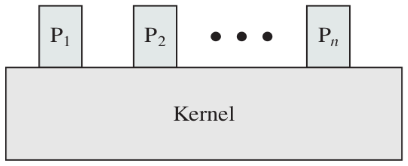

Enfoque 2 – El Kernel **dentro** del Proceso

- El **Código** del Kernel se encuentra dentro del espacio de direcciones de cada proceso.
- El Kernel se ejecuta  en el MISMO contexto que algún proceso de usuario
- El Kernel se puede ver como una colección de rutinas que el proceso utiliza
- Dentro de un proceso se encuentra el código del programa (user) y el código de los módulos de SW del SO
- Cada proceso tiene su propio stack (uno en modo usuario y otro en modo kernel)
- El proceso es el que se Ejecuta en Modo Usuario y el kernel del SO se ejecuta en Modo Kernel (cambio de modo)
- El código del Kernel es compartido por  todos los procesos
  - En administración de memoria veremos el “como”
- Cada interrupción (incluyendo las de  System Call) es atendida en el contexto del proceso que se encontraba en ejecución 
  - Pero en modo Kernel!!! (se pasa a este modo sin necesidad de hacer un cambio de contexto completo)
  - Si el SO determina que el proceso debe seguir ejecutándose luego de atender la interrupción, cambia a modo usuario y devuelve el control. Es mas económico y performante

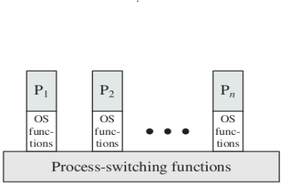

---

#### Monolitico


#### Microkernel


### Monolitico vs Microkernel


---

### Servicios

- **Administración y planificación del procesador**
  - Multiplexacióon de la carga de trabajo
  - Imparcialidad, **justicia** en la ejecución (Fairness) 
  - Que no haya bloqueos
  - Manejo de Prioridades
- **Administración de Memoria**
  - Administración de memoria eficientemente
  - Memoria física vs memoria virtual. Jerarquías de memoria
  - Protección de programas que compiten o se ejecutan concurrentemente
- **Administración del almacenamiento** (Sistema de archivos)
  - Acceso a medios de almacenamiento externos
- **Administración de dispositivos**
  - Ocultamiento de dependencias de HW
  - Administración  de accesos simultáneos
- **Detección de errores y respuestas**
  - Errores de HW internos y Externos
    - Errores de Memoria/CPU
    - Errores de Dispositivos
  - Errores de SW
    - Errores Aritméticos
    - Acceso no permitido a direcciones de memoria
  - Incapacidad del SO para conceder una solicitud de una aplicación
- **Interacción del Usuario (Shell)**
- **Contabilidad**
  - Recoger estadísticas del uso
  - Monitorear parámetros de rendimiento
  - Anticipar necesidades de mejoras futuras
  - Dar elementos si es necesario facturar  tiempo de procesamiento

---

### Apoyo del Hardware

#### Modos de Ejecución
Define limitaciones en el conjunto de instrucciones que se puede ejecutar en cada modo

- El bit en la CPU indica el modo actual
- Las instrucciones privilegiadas deben ejecutarse en modo **Supervisor o Kernel**
  - Necesitan acceder a estructuras del kernel, o ejecutar código que no es del proceso
- En modo **Usuario**, el proceso puede acceder sólo a su espacio de direcciones, es decir a las direcciones “propias”.
- El kernel del SO se ejecuta en modo supervisor
- El resto del SO y los programas de usuario se ejecutan en modo usuario (subconjunto de instrucciones permitidas)

Datos de Color

- Procesador Intel 8088 no tenía modo dual de operación ni protección por hardware.
- En MsDos las aplicaciones pueden acceder directamente a las funciones básicas de E/S para escribir directamente en pantalla o en disco.

Tener en cuenta que
- Cuando se arranque el sistema, arranca con el bit en modo supervisor. 
- Cada vez que comienza a ejecutarse un proceso de usuario, este bit se DEBE PONER en modo usuario.
  - Mediante una Instrucción especial.
- Cuando hay un trap o una interrupción, el bit de modo se pone en modo Kernel.
  - Única forma de pasar a Modo Kernel
  - No es el proceso de usuario quien hace el cambio explicitamente.

Como Actua

Cuando el proceso de usuario intenta por sí mismo ejecutar instrucciones que pueden causar problemas (las llamadas instrucciones privilegiadas), el HW lo detecta como una operación ilegal y produce un trap al SO.


En windows

- En WIN2000 el modo núcleo ejecuta los servicios ejecutivos. El modo usuario ejecuta los procesos de usuario. 
- Cuando un programa se bloquea en modo usuario, a lo sumo se escribe un suceso en el registro de sucesos. Si el bloqueo se produce estando en modo supervisor se genera la BSOD (pantalla azul de la muerte).

### En resumen

Modo kernel
- Gestión de procesos: Creación y terminación ,  planificación, intercambio, sincronización y soporte para la comunicación entre procesos
- Gestión de memoria: Reserva de espacio de direcciones para los procesos, Swapping, Gestión y páginas de segmentos
- Gestión E/S: Gestión de buffers, reserva de canales de E/S y de dispositivos de los procesos
- Funciones de soporte: Gestión de interrupciones, auditoría, monitoreo

Modo usuario
- Debug de procesos, definición de protocolos de comunicación gestión de aplicaciones (compilador, editor, aplicaciones de usuario
- En este modo se llevan a cabo todas las tareas que no requieran accesos privilegiados
- En este modo no se puede interactuar con el hardware
- El proceso trabaja en su propio espacio de direcciones

---

#### Interrupción  de Clock
Se debe evitar que un proceso se apropie de la CPU

---

### Protecciones

#### Protección de la Memoria

Se deben definir límites de memoria a los que puede acceder cada proceso (registros base y límite)

- Delimitar el espacio de direcciones del proceso
- Poner limites a las direcciones que puede utilizar un proceso
  - Por ejemplo: Uso de un registro base y un registro límite
  - El kernel carga estos registros por medio de instrucciones privilegiadas. Esta acción sólo puede realizarse en modo Kernel 

La memoria principal aloja al SO y a los procesos de usuario
- El kernel debe proteger para que los procesos de usuario no puedan acceder donde no les corresponde
- El kernel debe proteger el espacio de direcciones de un proceso del acceso de otros procesos.


### Protección de la E/S

- Las instrucciones de E/S se definen como privilegiadas. 
- Deben ejecutarse en Modo Kernel
  - Se deberían gestionar en el kernel del sistema operativo 
  - Los procesos de usuario realizan E/S a través de llamadas al SO (es un servicio del SO)

### Protección de la CPU

- Uso de interrupción por clock para evitar que un proceso se apropie de la CPU
- Se implementa normalmente a través de un clock y un contador. 
- El kernel le da valor al contador que se decrementa con cada tick de reloj y al llegar a cero puede expulsar al proceso para ejecutar otro.
- Las instrucciones que modifican el funcionamiento del reloj son privilegiadas. 
- Se le asigna al contador el valor que se quiere que se ejecute un proceso. 
- Se la usa también para el cálculo de la hora actual, basándose en cantidad de interrupciones ocurridas cada tanto tiempo y desde una fecha y hora determinada. 

---

## System Calls

- Es la forma en que los programas de usuario acceden a los servicios del SO.
- Los parámetros asociados a las llamadas pueden pasarse de varias maneras: por registros, bloques o tablas en memoria ó la pila.
  - **count=read(file, buffer, nbytes);**
- Se ejecutan en modo kernel o supervisor


**Categorias**

- Control de Procesos

- Manejo de archivos

- Manejo de dispositivos

- Mantenimiento de información del sistema

- Comunicaciones

Ejemplo 


- Para activar iniciar la system call se indica:
  - El número de syscall que se quiere ejecutar
  - Los parámetros de esa syscall
- Luego se emite una interrupción para pasar a modo Kernel y gestionar la systemcall
- El manejador de interrupciones (syscall handler) evalúa la system call deseada y la ejecuta

Mas ejemplos


---

# Elementos basicos de una computadora

## Registros del Procesador

### Visibles por el usuario

- Registros que pueden ser usados por las aplicaciones
- Pueden ser referenciados por lenguaje de máquina
- Disponible para programas/aplicaciones
- Tipos de registros
  - Datos 
  - Direcciones
    - Index
    - Segment pointer
    - Stack pointer

### De Control y estado

- Para control operativo del procesador
- Usados por rutinas privilegiadas del SO para controlar la ejecución de procesos

#### Program Counter (PC)
- Contiene la dirección de la proxima instrucción a ser ejecutada

---

#### Instruction Register (IR)
- Contiene la instrucción a ser ejecutada
- La instrucción referenciada por el PC se almacena en el IR y se ejecuta
- Categorías de instrucciones
  - **Procesador - Memoria** (Transfiere datos entre procesador y memoria)
  - **Procesador - E/S** (Transfiere datos a/o desde periféricos)
  - **Procesamiento de Datos** (Operaciones aritméticas o lógicas sobre datos)
  - **Control** (Alterar secuencia de ejecución)

#### Program Status Word (PSW)
- Contiene códigos de resultado de operaciones
- habilita/deshabilita Interrupciones 
- Indica el modo de ejecución (Supervisor/usuario)

---

### Ciclo de Instrucción

Dos pasos

#### Fetch (Procesador lee la instrucción desde la memoria)

- El procesador busca (fetch) la instrucción en la memoria
  - (PC) → IR
- El PC se incrementa después de cada fetch para apuntar a la próxima instrucción
  - PC = PC + 4


#### Execute (Procesador ejecuta la instrucción)


---


## Interrupciones

- Interrumpen el secuenciamiento del procesador durante la ejecución de un proceso
- Dispositivos de E/S más lentos que el procesador (Procesador debe esperar al dispositivo)

| Flujo de control SIN  interrupciones | Flujo de control CON  interrupciones |
| --- | --- |
|  |  |

### Interrupt Handler

- Programa (o rutina) que determina la naturaleza de una interrupción y realiza lo necesario para atenderla
  - Por ejemplo, para un dispositivo particular de E/S
- Generalemente es parte del SO

Suspende la secuencia normal de ejecución


Ciclo de interrupción


- El procesador chequea la existencia de interrupciones. 
- Si no existen interrupciones, la próxima instrucción del programa es ejecutada
- Si hay pendiente alguna interrupción, se suspende la ejecución del progama actual y se ejecuta la rutina de manejo de interrupciones

Simple Interrupt Processing


Multiples Interrupciones

Deshabilitar las interrupciones mientras una interrupción está siendo procesada.


|  |  |
| --- | --- |

---

## Sistema Batch

Baja utilización de la CPU

Dispositivos de E/S mucho mas lentos con respecto a la CPU

Ante instrucción de E/S, el procesador permanece ocioso. Cuando se completa la E/S, se continua con la ejecución del programa que se estaba ejecutando

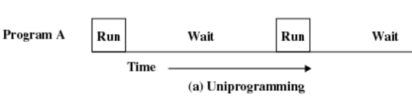


## Multiprogramación

- La operación de los sistemas batch se vio beneficiada del spooling de las tareas, al solapar la E/S de una tarea de la ejecución de otra
- Al estar las tareas cargadas en disco, ya no era necesario ejecutarlas en el orden en el que fueron cargadas (job scheduling)
- El SO mantiene varias tareas en memoria al mismo tiempo.
- La secuencia de programas es de acuerdo a prioridad u orden de llegada
- Cuando el proceso necesita realizar una operación de E/S, la CPU en lugar de permanecer ociosa, es utilizada para otro proceso.
- Después que se completa la atención de la interrupción, el control puede o no retornar al programa que se estaba ejecutando al momento de la interrupción


Tiempo Compartido

- Utiliza la multiprogramación para manejar múltiples trabajos interactivos
- El tiempo del procesador es compartido entre múltiples trabajos. 
- Múltiples usuarios podrían acceder simultáneamente al sistema utilizando terminales
- Los procesos usan la CPU por un periodo máximo de tiempo, luego del cual se le da la CPU a otro proceso


---

# Procesos

Definicion

- Es un programa en ejecución
- Para nosotros serán sinónimos: tarea, job  y proceso

### Diferencias entre un programa y un proceso

| Programa | Proceso |
| --- | --- |
| Es estatico | Es dinamico |
| No tiene program counter | Tiene Program Counter |
| Existe desde que se edita hasta que se borra | Su ciclo de vida comprende desde que se solicita ejecutar hastas que termina |

El modelo de proceso

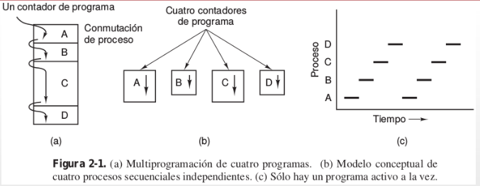

- Multiprogramación de 4 procesos
- Modelo conceptual de 4 procesos secuenciales e independientes. 
- Solo un proceso se encontrara activo en cualquier instante. (Si tenemos una sola CPU)

### Componentes de un proceso

Proceso: Entidad de abstracción

Un proceso (para poder ejecutarse) incluye como mínimo: 
- Sección de Código (texto)
- Sección de Datos (variables globales)
- Stack(s) (datos temporarios: parámetros , variables temporales y direcciones de retorno)

#### Stacks

- Un proceso cuenta con 1 o mas stacks
  - En general: modo Usuario y modo Kernel
- Se crean automáticamente y su medida se ajusta en run-time.
- Está formado por stack frames que son pushed (al llamar a una rutina) y popped (cuando se retorna de ella)
- El stack frame tiene los parámetros de la rutina(variables locales), y datos necesarios para recuperar el stack frame anterior (el contador de programa y el valor del stack pointer en el momento del llamado)

#### Atributos de un proceso

- Identificación del proceso, y del proceso padre
- Identificación del usuario que lo “disparó”
- Si hay estructura de grupos, grupo que lo disparó
- En ambientes multiusuario, desde que terminal y quien lo ejecuto

#### PCB (Process Control Block)

- Estructura de datos asociada al proceso (abstracción)
- Existe una por proceso.
- Es lo primero que se crea cuando se crea un proceso y lo último que se borra cuando termina
- Contiene  la información asociada con cada proceso:
  - PID, PPID, etc
  - Valores de los registros de la CPU (PC, AC, etc)
  - Planificación (estado, prioridad, tiempo consumido, etc)
  - Ubicación (representación) en memoria
  - Accounting
  - Entrada salida (estado, pendientes, etc)


#### Qué es el espacio de direcciones de un proceso?

- Es el conjunto de direcciones de memoria que ocupa el proceso
  - stack, text y datos
- No incluye su PCB o tablas asociadas
- Un proceso en modo usuario puede acceder sólo a su espacio de direcciones; 
- En modo kernel, se puede acceder a estructuras internas (PCB del proceso por ejemplo) o a espacios de direcciones de otros procesos.

Espacio de direcciones del proceso + PCB

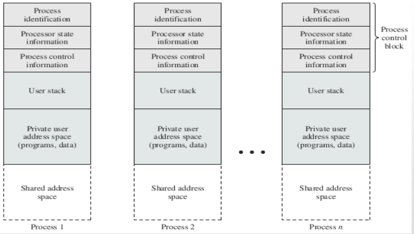

#### El contexto de un proceso

- Incluye toda la información que el SO necesita para administrar el proceso, y la CPU para ejecutarlo correctamente.
- Son parte del contexto, los registros de cpu, inclusive el contador de programa, prioridad del proceso, si tiene E/S pendientes, etc.

#### Cambio de Contexto (Context Switch)

- Se produce cuando la CPU cambia de un proceso a otro.
- Se debe resguardar el contexto del proceso saliente, que pasa a espera y retornará después a la CPU.
- Se debe cargar el contexto del nuevo proceso y comenzar desde la instrucción siguiente a la última ejecutada en dicho contexto.
- Es tiempo no productivo de CPU
- El tiempo que consume depende del soporte de HW

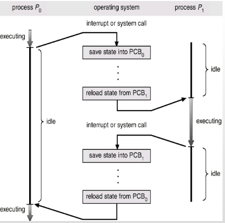

---

### Estados de un proceso

En su ciclo de vida, un proceso pasa por diferentes estados.
- Nuevo (new)
- Listo para ejecutar (ready)
- Ejecutándose (running)
- En espera (waiting)
- Terminado (terminated)

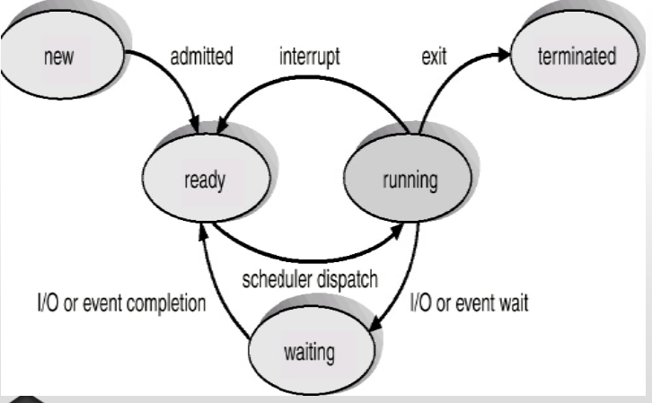

### Comportamiento de los procesos

Procesos alternan ráfagas de CPU y de I/O

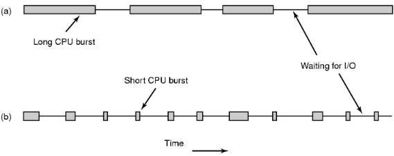

- CPU-bound (Mayor parte del tiempo utilizando la CPU)
- I/O-bound (I/O = E/S) (Mayor parte del tiempo esperando por I/O)
- La velocidad de la CPU es mucho mas rápida que la de los dispositivos de E/S
  - Pensar: Necesidad de atender rápidamente procesos I/O-bound para mantener el dispositivo ocupado y aprovechar la CPU para procesos CPU-bound

---

### Colas en la planificación de procesos

- Para realizar la planificación, el SO utiliza la PCB de cada proceso como una abstracción del mismo
- Las PCB se enlazan en Colas siguiendo un orden determinado
- Ejemplos
- Cola de trabajos o procesos (Contiene todas  las PCB de procesos en el sistema)
- Cola de procesos listos (PCB de procesos residentes en memoria principal esperando para ejecutarse)
- Cola de dispositivos (PCB de procesos esperando por un dispositivo de I/O)

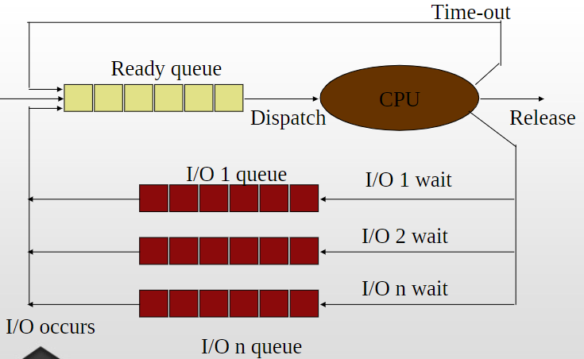

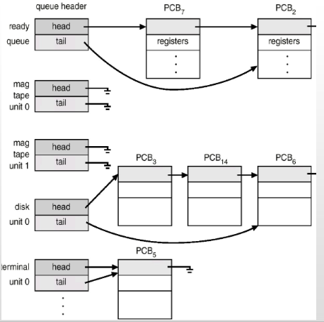

### Planificación
- Planificación: (Necesidad de determinar cual de todos los procesos que están listos para ejecutarse, se ejecutará a continuación en un ambiente multiprogramado)
- Algoritmo de Planificación (Algoritmo utilizado para realizar la planificación del sistema)

#### Categorías de los Algoritmos de Planificación

- Según el ambiente es posible requerir algoritmos de planificación diferentes, con diferentes metas:
  - Equidad: Otorgar una parte justa de la CPU a cada proceso
  - Balance: Mantener ocupadas todas las partes del sistema
- Ejemplos:
  - Procesos por lotes (batch)
  - Procesos Interactivos
  - Procesos en Tiempo Real

#### Procesos Batch

- No existen usuarios que esperen una respuesta en una terminal.
- Se pueden utilizar algoritmos no apropiativos
- Metas propias de este tipo de algoritmos:
  - Rendimiento: Maximizar el número de trabajos por hora
  - Tiempo de Retorno: Minimizar los tiempos entre el comienzo y la finalización
  - El Tiempo es espera se puede ver afectado
  - Uso de la CPU: Mantener la CPU ocupada la
- Ejemplos de Algoritmos:
  - FCFS – First Come First Served
  - SJF – Shortest Job First

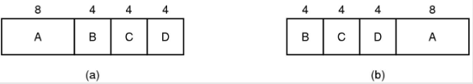

#### Procesos Interactivos

- No solo interacción con los usuarios
  - Un servidor, necesita de varios procesos para dar respuesta a diferentes requerimientos
- Son necesarios algoritmos apropiativos para evitar que un proceso acapare la CPU
- Metas propias de este tipo de algoritmos:
  - Tiempo de Respuesta: Responder a peticiones con rapidez
  - Proporcionalidad: Cumplir con expectativas de los usuarios
    - Si el usuario le pone STOP al reproductor de música, que la música deje de ser reproducida en un tiempo considerablemente corto.

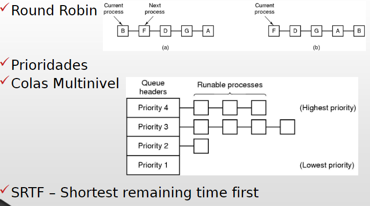

**Módulos de la planificación**

- Son módulos (SW) del Kernel que realizan distintas tareas asociadas a la planificación.
- Se ejecutan ante determinados eventos que así lo requieren:
  - Creación/Terminación de procesos
  - Eventos de Sincronización o de E/S
  - Finalización de lapso de tiempo 
  - Etc
- Scheduler de long term
- Scheduler de short term
- Scheduler de medium term
- Su nombre proviene de la frecuencia de ejecución.
- Otros módulos: **Dispatcher** y **Loader**
- Pueden no existir como módulos separados de los schedulers vistos, pero la función debe cumplirse.
- **Dispatcher** hace cambio de contexto, cambio de modo de ejecución...”despacha” el proceso elegido por el Short Term (es decir, “salta” a la instrucción a ejecutar).
- **Loader** carga en memoria el proceso elegido por el long term

---

### Política Versus Mecanismo

- Existen situaciones en las que es necesario que la planificación de uno o varios procesos se  comporte de manera diferente
- El algoritmo de planificación debe estar parametrizado, de manera que los procesos/usuarios pueden indicar los parámetros para modificar la planificación
- El Kernel implementa el mecanismo
- El usuario/proceso/administrador utiliza los parámetros para determinar la Política
- Ejemplo:
  - Un algoritmo de planificación por prioridades y una System Call que permite modificar la prioridad de un proceso (man nice)
  - Un proceso puede determinar las prioridades de los procesos que el crea, según la importancia de los mismos.


---

#### Long Term Scheduler

- Controla el grado de multiprogramación, es decir, la cantidad de procesos en memoria.
- Puede no existir este scheduler y absorber esta tarea el de short term.

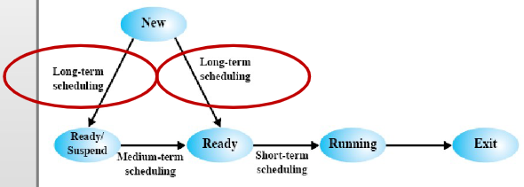

#### Medium Term Scheduler (swapping)

- Si es necesario, reduce el grado de multiprogramación
- Saca temporalmente de memoria los procesos que sea necesario para mantener el equilibrio del sistema.
- Términos asociados: swap out (sacar de memoria), swap in (volver a memoria).

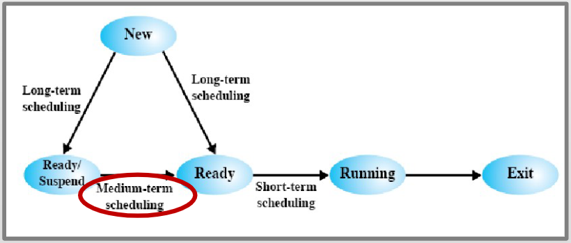

#### Short Term Scheduler

- Decide a cuál de los procesos en la cola de listos se elige para que use la CPU.
- Términos asociados: apropiativo, no apropiativo, algoritmo de scheduling

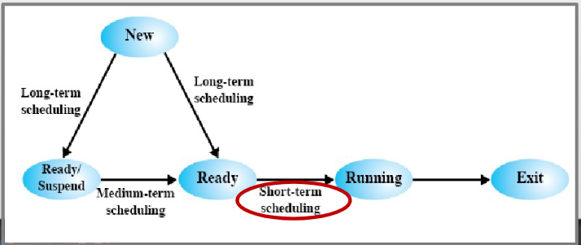

#### Procesos en espera y swapeado

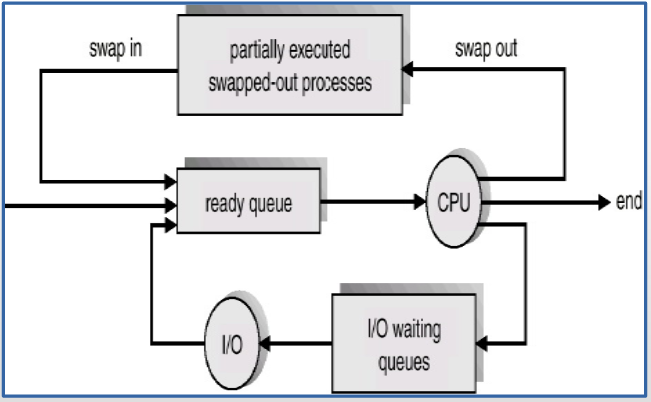

#### Sobre el estado nuevo (new)

- Un usuario “dispara” el proceso. Un proceso es creado por otro proceso: su proceso padre.
- En este estado se crean las estructuras asociadas, y el proceso queda en la cola de procesos, normalmente en espera de ser cargado en memoria

#### Sobre el estado listo (ready)

- Luego que el scheduller de largo plazo eligió al proceso para cargarlo en memoria, el proceso queda en estado listo
- El proceso sólo necesita que se le asigne CPU
- Está en la cola de procesos listos (ready queue)

#### Sobre el estado en ejecución (running)

- El scheduler de corto plazo lo eligió para asignarle CPU
- Tendrá la CPU hasta que se termine el período de tiempo asignado (quantum o time slice), termine o hasta que necesite realizar alguna operación de E/S

#### Sobre el estado de espera (waiting)

El proceso necesita que se cumpla el evento esperado para continuar.
El evento puede ser la terminación de una E/S solicitada, o la llegada de una señal por parte de otro proceso.
Sigue en memoria, pero no tiene la CPU.
Al cumplirse el evento, pasará al estado de listo.


#### Transiciones

- **New-Ready** Por elección del scheduler de largo plazo (carga en memoria)
- **Ready-Running** Por elección del scheduler de corto plazo (asignación de CPU)
- **Running-Waiting** el proceso “se pone a dormir”, esperando por un evento.
- **Waiting-Ready** Terminó la espera y compite nuevamente por la CPU.

#### Caso especial: running-ready

- Cuando el proceso termina su quantum (franja de tiempo) sin haber necesitado ser interrumpirlo por un evento, pasa al estado de ready, para competir por CPU, pues no está esperando por ningún evento...
- Se trata de un caso distinto a los anteriores, porque el procesos es expulado de la CPU contra su voluntad
- Esta situación se da en algoritmos apropiativos

#### Explicación por estado

- **`1)`** Ejecución en modo usuario 
- **`2)`** Ejecución en modo kernel 
- **`3)`** El proceso está listo para ser ejecutado cuando sea elegido. 
- **`4)`** Proceso en espera en memoria principal. 
- **`5)`** Proceso listo, pero el swapper debe llevar al proceso a memoria ppal antes que el kernel lo pueda elegir para ejecutar
- **`6)`** Proceso en espera en memoria secundaria.
- **`7)`** Proceso retornando desde el modo kernel al user. Pero el kernel se apropia, hace un context switch para darle la CPU a otro proceso. 
- **`8)`** Proceso recientemente creado y en transición: existe, pero aun no está listo para ejecutar, ni está dormido. 
- **`9)`** El proceso ejecutó la system call exit y está en estado zombie. Ya no existe más, pero se registran datos sobre su uso, codigo resultante del exit. Es el estado final.

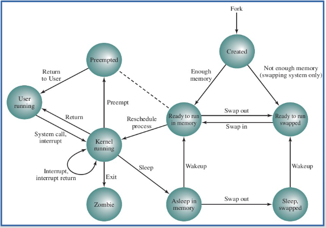

---

## Algoritmos Apropiativos y No Apropiativos

- La apropiación esta relaciona al recurso CPU
- En los algoritmos Apropiativos (preemtive) existen situaciones que hacen que el proceso en ejecución sea expulsado, por el planificador de corto plazo, de la CPU
- En los algoritmos No Apropiativos (nonpreemptive) los procesos se ejecutan hasta que el mismo (por su propia cuenta) abandone la CPU

- Apropiativos
  - Round Robin
  - SRTF
  - Prioridades Apropiativo
- No Apropiativos
  - FCFC
  - SJF
  - Prioridades No apropiativo

### No Apropiativos

El proceso deja el estado de ejecución solo cuando:
- Termina (Syscall Exit)
- Se bloquea voluntariamente (SysCall wait, sleep, etc)
- Solicita una operación de E/S (Syscall Read, Write, etc)

En los algoritmos No Apropiativo (nonpreemptive) los procesos se ejecutan hasta que el mismo (por su propia cuenta) abandone la CPU
- Se bloquea por E/S o finaliza
- No hay decisiones de planificación durante las interrupciones de reloj


### Apropiativos

El proceso puede ser expulsado de la CPU según la planificación implementada

- Se le termina su quantum (Algoritmo round robin)
- Llega a la cola de listos un proceso de mayor prioridad (Algoritmo prioridades apropiativo)
- Llega a la cola de listos un proceso con menor tiempo restante (Algoritmo SRTF)

En los algoritmos Apropiativos (preemtive) existen situaciones que hacen que el proceso en ejecución sea expulsado de la CPU


## Creación de Procesos

- Un proceso es creado por otro proceso
- Un proceso padre tiene uno o más procesos hijos.
- Se forma un árbol de procesos
- En UNIX:
  - system call fork() crea nuevo proceso
  - system call execve(), generalmente usada después del fork, carga un nuevo programa en el espacio de direcciones.
- En Windows:
  - system call CreateProcess() crea un nuevo proceso y carga el programa para ejecución

### Actividades de la creación

- Crear la PCB
- Asignar PID (Process IDentification) único
- Asignarle memoria para regiones (Stack, Text y Datos)
- Crear estructuras de datos asociadas (Fork (copiar el contexto, regiones de datos, text y stack))

### Relación entre procesos Padre e Hijo

Con respecto a la Ejecución:
- El padre puede continuar ejecutándose concurrentemente con su hijo
- El padre puede esperar a que el proceso hijo (o los procesos hijos) terminen para continuar la ejecución.

Con respecto al Espacio de Direcciones:
- El hijo es un duplicado del proceso padre (caso Unix)
- Se  crea el proceso y se le carga adentro el programa (caso Windows)

### Terminación de procesos
- Ante un (**exit**), se retorna el control al sistema operativo
  - El proceso padre puede esperar recibir un código de retorno (via **wait**). Generalmente se lo usa cuando se requier que el padre espere a los hijos.
- Proceso padre puede terminar la ejecución de sus hijos (**kill**)
  - La tarea asignada al hijo se terminó
  - Cuando el padre termina su ejecución
    - Habitualmente no se permite a los hijos continuar, pero existe la opción.
    - Terminación en cascada

Exec Code

encuentre el programa ejecutable verifique el permiso de ejecución lea y verifique los argumentos de copia del encabezado, del entorno al kernel libere el espacio de direcciones antiguo asigne nuevos argumentos de copia del espacio de direcciones, del entorno a la pila Restablezca las señales inicialice los registros

#### Procesos Cooperativos e Independientes
- **Independiente**  el proceso no afecta ni puede ser afectado por la ejecución de otros procesos. No comparte ningún tipo de dato.
- **Cooperativo**  afecta o es afectado por la ejecución de otros procesos en el sistema. 

#### Para qué sirven los procesos cooperativos?
- Para compartir información (por ejemplo, un archivo)
- Para acelerar el cómputo (separar una tarea en sub-tareas que cooperan ejecutándose paralelamente)
- Para planificar tareas de manera tal que se puedan ejecutar en paralelo.


---

# Tema 3

## Memoria
- La organización y administración de la “memoria principal es uno de los factores más importantes en el diseño de los S. O.
- Los programas y datos deben estar en el almacenamiento principal para: 
- Poderlos ejecutar. 
- Referenciarlos directamente
- El SO debe: 
  - Llevar un registro de las partes de memoria que se están utilizando y de aquellas que no. 
  - Asignae espacio en memoria principal a los procesos cuando estos la necesitan. 
  - Libera espacio de memoria asignada a procesos que han terminado.
  - Lograr que el programador se abstraiga de la alocación de los programas
  - Brindar seguridad entre los procesos para que unos no accedan a secciones privadas de otros
  - Brindar la posibilidad de acceso compartido a determinadas secciones de la memoria (librerías, código en común, etc.)
  - Garantizar la performance del sistema
- Se espera de un S.O. un uso eficiente de la memoria con el fin de alojar el mayor número de procesos

### Administración de Memoria

- División Lógica de la Memoria Física para alojar múltiples procesos
  - Garantizando protección
  - Depende del mecanismo provisto por el HW
- Asignación eficientemente 
  - Contener el mayor numero de procesos para garantizar el mayor uso de la CPU por los mismos

### Requisitos

- **Reubicación**
  - El programador no debe ocuparse de conocer donde será colocado en la Memoria RAM
  - Mientras un proceso se ejecuta, puede ser sacado y traído a la memoria (swap) y, posiblemente, colocarse en diferentes direcciones.
  - Las referencias a la memoria se deben “traducir” según ubicación actual del proceso.
- **Protección**
  - Los procesos NO deben referenciar – acceder -  a direcciones de memoria de otros procesos 
    - Salvo que tengan permiso
- El chequeo se debe realizar durante la ejecución:
  - NO es posible anticipar todas las referencias a memoria que un proceso puede realizar.
- Compartición
  - Permitir que varios procesos accedan a la misma porción de memoria. 
    - Ej: Rutinas comunes, librerías, espacios explícitamente  compartidos, etc.
- Permite un mejor uso – aprovechamiento - de la memoria RAM, evitando copias innecesarias (repetidas) de instrucciones

### Abstracción - Espacio de Direcciones

- Rango de direcciones (a memoria) posibles que un proceso puede utilizar para direccionar sus instrucciones y datos.
- El tamaño depende de la Arquitectura del 
Procesador
  - 32 bits: 0 .. 2^32 - 1  
  - 64 bits: 0 .. 2^64 – 1
- Es independiente de la ubicación “real” del 
proceso en la Memoria RAM

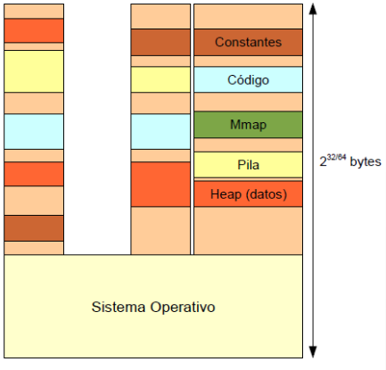

### Direcciones

- Lógicas
  - Referencia a una localidad de memoria independiente de la asignación actual de los datos en la memoria.
  - Representa una dirección en el “Espacio de Direcciones del Proceso” 
- Físicas
  - Referencia una localidad en la Memoria Física (RAM)
    - Dirección absoluta
  - En caso de usar direcciones Lógicas, es necesaria algún tipo de conversión a direcciones Físicas

### Conversión de Direcciones

Una forma simple de hacer esto es utilizando registros auxiliares

- **Registro Base**
  - Dirección de comienzo del Espacio de Direcciones del proceso en la RAM 
- **Registro Limite**
  - Dirección final del proceso o medida del proceso 
  - Tamaño de su Espacio de Direcciones 
- Ambos valores se fijan cuando el espacio de direcciones del proceso es cargado a memoria.
- Varían entre procesos (Context Switch)

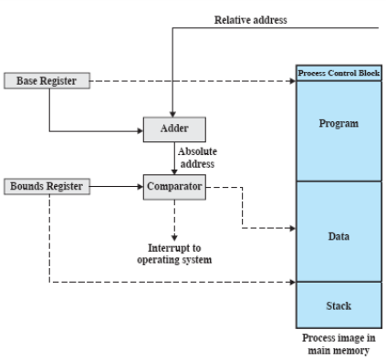

#### Dir. Lógicas vs. Físicas
- Si la CPU trabaja con direcciones lógicas, para acceder a memoria principal, se deben transformar en direcciones físicas. 
  - Resolución de direcciones (address-binding): transformar la dirección lógica en la dirección física correspondiente
- Resolución en momento de compilación (Archivos .com de DOS) y en tiempo de carga
  - Direcciones Lógicas y Físicas son idénticas
  - Para reubicar un proceso es necesario recompilarlo o recargarlo.
- Resolución en tiempo de ejecución
  - Direcciones Lógicas y Físicas son diferentes
  - Direcciones Lógicas son llamadas “Direcciones Virtuales”
  - La reubicación se puede realizar fácilmente
  - El mapeo entre “Virtuales” y “Físicas” es realizado por hardware
    -  Memory Management Unit (MMU)

### Memory Management Unit (MMU)

- Dispositivo de Hardware que mapea direcciones virtuales a físicas
  - Es parte del Procesador
  - Re-programar el MMU es una operación privilegiada 
    - solo puede ser realizada en Kernel Mode
- El valor en el “registro de realocación” es sumado a cada dirección generada por el proceso de usuario  al momento de acceder a la memoria.
  - Los procesos nunca usan direcciones físicas

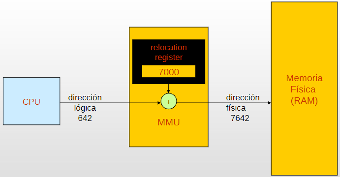

### Mecanismos de asignación de memoria

- Particiones Fijas: El primer esquema implementado
  - La memoria se divide en particiones o regiones de tamaño Fijo (pueden ser todas del mismo tamaño o no)
  - Alojan un proceso cada una
  - Cada proceso se coloca de acuerdo a algún criterio (First Fit, Best Fit, Worst Fit, Next Fit) en alguna partición
- Particiones dinámicas: La evolución del esquema anterior
  - Las particiones  varían en tamaño y en número
  - Alojan un proceso cada una
  - Cada partición se genera en forma dinámica del tamaño justo que necesita el proceso

¿Qué problemas se generan en cada caso?

## Fragmentación

La fragmentación se produce cuando una localidad de memoria no puede ser utilizada por no encontrarse en forma contigua

### Fragmentación Interna:
- Se produce en el esquema de particiones Fijas
- Es la porción de la partición que queda sin utilizar

### Fragmentación Externa:
- Se produce en el esquema de particiones dinámicas
- Son huecos que van quedando en la memoria a medida que los procesos finalizan
- Al no encontrarse en forma contigua puede darse el caso de que tengamos memoria libre para alocar un proceso, pero que no la podamos utilizar
- Para solucionar el problema se puede acudir a la compactación, pero es muy costosa


### Problemas del esquema

- El esquema de Registro Base + Limite presenta 
problemas:
  - Necesidad de almacenar el Espacio de Direcciones de forma continua en la Memoria Física
  - Los primeros SO definían particiones fijas de memoria, luego evolucionaron a particiones dinámicas
  - Fragmentación 
  - Mantener “partes” del proceso que no son necesarias
  - Los esquemas de particiones fijas y dinámicas no se usan hoy en día
- Solución:
  - Paginación
  - Segmentación

## Paginación

- Memoria Física es dividida lógicamente en pequeños trozos de igual tamaño  Marcos
- Memoria Lógica (espacio de direcciones) es dividido en trozos de igual tamaño que los marcos -> Paginas
- El SO debe mantener una tabla de paginas por cada proceso, donde cada entrada contiene (entre otras) el Marco en la que se coloca cada pagina.
- La dirección lógica se interpreta como: 
  - un numero de pagina y un desplazamiento dentro de la misma.

## Segmentación

- Esquema que se asemeja a la “visión del usuario”. El programa se divide en partes/secciones
- Un programa es una colección de segmentos. Un segmento es una unidad lógica como:
  - Programa Principal, Procedimientos y Funciones, variables locales y globales, stack, etc.
- Puede causar Fragmentación
- Todos los segmentos de un programa pueden no tener el mismo tamaño (código, datos, rutinas).
- Las direcciones Lógicas consisten en 2 partes: 
  - Selector de Segmento 
  - Desplazamiento dentro del segmento
- Tabla de Segmentos
  - Permite mapear la dirección lógica en física. Cada entrada contiene:
    - Base: Dirección física de comienzo del segmento
    - Limit: Longitud del Segmento
- Segment-table base register (STBR): apunta a la ubicación de la tabla de segmentos.
- Segment-table length register (STLR) : cantidad de segmentos de un programa


### Segmentación Paginada

- La paginación
  - Transparente al programador
  - Elimina Fragmentación externa.
- Segmentación
  - Es visible al programador
  - Facilita modularidad, estructuras de datos grandes y da mejor soporte a la compartición y protección
- Segmentación Paginada: Cada segmento es dividido en paginas de tamaño fijo.


## Hasta ahora

- Con paginación vimos que el espacio de direcciones de un  proceso no necesariamente debe estar “contiguo” en la memoria para poder ejecutarse
  - El hardware traduce direcciones lógicas a direcciones físicas utilizando las tablas de páginas que el SO administra

## Motivación para Memoria Virtual

- Podemos pensar también que, no todo el espacio de direcciones del proceso se necesito en todo momento:
  - Rutinas o Librerías que se ejecutan una única vez (o nunca)
  - Partes del programa que no vuelven a ejecutarse
  - Regiones de memoria alocadas dinámicamente y luego liberadas
  - Etc.
- No hay necesidad que la totalidad la imagen del proceso sea cargada en memoria

### Como se puede trabajar..

- El SO puede traer a memoria las “piezas” de un proceso a medida que éste las necesita. 
- Definiremos como “Conjunto Residente” a la porción del espacio de direcciones del proceso que se encuentra en memoria.
  - Alguna bibliografía lo llama “Working Set”
- Con el apoyo del HW:
  - Se detecta cuando se necesita una porción del proceso que no está en su Conjunto Residente
  - Se debe cargar en memoria dicha porción para continuar con la ejecución.

### Ventajas

- Más procesos pueden ser mantenidos en memoria.
  - Sólo son cargadas algunas secciones de cada proceso.
  - Con más procesos en memoria principal es más probable que existan más procesos Ready
- Un proceso puede ser mas grande que la memoria Principal
  - El usuario no se debe preocupar por el tamaño de sus programas
  - La limitación la impone el HW y el bus de direcciones

### ¿Que se necesita para Memoria Virtual?

- El hardware debe soportar paginación por demanda (y/o segmentación por demanda)
- Un dispositivo de memoria secundaria (disco) que dé el apoyo para almacenar las secciones del proceso que no están en Memoria Principal (área de intercambio)
- El SO debe ser capaz de manejar el movimiento de las páginas (o segmentos) entre la memoria principal y la secundaria.

### Memoria Virtual con Paginación

- Cada proceso tiene su tabla de páginas
- Cada entrada en la tabla referencia al frame o marco en el que se encuentra la página en la memoria principal
- Cada entrada en la tabla de páginas tiene bits de control (entre otros):
- Bit V: Indica si la página está en memoria
- Bit M: Indica si la página fue modificada. Si se modificó, en algún momento, se deben reflejar los cambios en Memoria Secundaria

### Memoria Virtual con Paginación

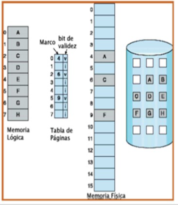

### Fallo de páginas (Page Fault)

- Ocurre cuando el proceso intenta usar una dirección que está en una página que no se encuentra en la memoria principal. Bit V=0 (también marcado con i = inválido)
- La página no se encuentra en su conjunto residente
- El HW detecta la situación y genera un trap al S.O.
- El S.O. Podrá colocar al proceso en estado de “Blocked” (espera) mientras gestiona que la página que se necesite se cargue.
- El S.O. busca un “Frame o Marco Libre” en la memoria y genera una operación de E/S al disco para copiar en dicho Frame la página del proceso que se necesita utilizar.
- El SO puede asignarle la CPU a otro proceso mientras se completa la E/S
  - La E/S se realizará y avisará mediante interrupción su finalización.
- Cuando la operación de E/S finaliza, se notifica al SO y este:
  - Actualiza la tabla de páginas del proceso
    - Coloca el Bit V en 1 en la página en cuestión
    - Coloca la dirección base del Frame donde se colocó la página
  - El proceso que generó el Fallo de Página vuelve a estado de Ready (listo)
  - Cuando el proceso se ejecute, se volverá a ejecutar la instrucción que antes generó el fallo de página


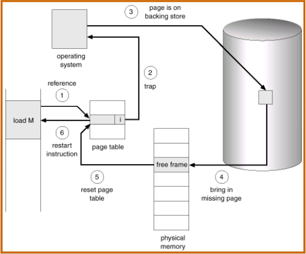


### Performance

- Si los page faults son excesivos, la performance del sistema decae
- Tasa de Page Faults  0  p  1
  - Si p = 0 no hay page faults
  - Si p = 1, cada a memoria genera un page fault
- Effective Access Time (EAT)
```
EAT = (1 – p) x memory access 
   + p x (page_fault_overhead +
    [swap_page_out]     +
      swap_page_in +
    restart_overhead)
```

Podría ocurrir que no haya marcos disponibles, con lo cual habrá que descargar uno para lograr espacio para la nueva página entrante

### Tabla de Páginas 

- Cada proceso tiene su tabla de páginas
- El tamaño de la tabla de páginas depende del espacio de direcciones del proceso.
- Puede alcanzar un tamaño considerable
- Formas de organizar:
  - Tabla de 1 nivel: Tabla única lineal
  - Tabla de 2 niveles (o más, multinivel)
  - Tabla invertida: Hashing
- La forma de organizarla depende del HW subyacente

### Tabla de 1 nivel – 32 bits

- Direcciones de 32bits
- Ejemplo
  - Cantidad de Page Table Entries (PTEs) máximas que puede tener un proceso = 220
  - El tamaño de cada página es de 4KB
  - El tamaño de cada PTE es de 4 bytes
    - Cantidad de PTEs que entran en un marco: 4KB/4B = 210
- Tamaño de tabla de páginas
  - Cantidad de marcos necesarios para todas las PTEs de la tabla de páginas de un proceso = 220/210 = 210
  - Tamaño tabla de páginas del proceso:210 * 4bytes = 4MB por proceso 
  - Más de 16.000GB por proceso!!!

### Tabla de páginas - Tabla de 2 niveles

- El propósito de la tabla de páginas multinivel es dividir la tabla de páginas lineal en múltiples tablas de páginas
- Cada tabla de páginas suele tener el mismo tamaño pero se busca que tengan un menor número de páginas por tabla
- La idea general es que cada tabla sea más pequeña
- Se busca que la tabla de páginas no ocupe demasida memoria RAM
- Además solo se carga una parcialidad de la tabla de páginas (solo lo que se necesite resolver)
- Existe un esquema de direccionamientos indirectos

### Tabla de Paginas (cont.) - Tabla invertida

- Utilizada en Arquitecturas donde el espacio de direcciones es muy grande
  - Las tablas de paginas ocuparían muchos niveles y la traducción sería costosa
  - Por esta razón se adopta esta técnica
- Por ejemplo, si el espacio de direcciones es de 264 bytes, con páginas de 4 KB, necesitamos una tabla de páginas con 252 entradas
- Si cada entrada es de 8 bytes, la tabla es de más de 30 millones de Gigabyes (30 PB)
- Hay una entrada por cada marco de página en la memoria real. Es la visión inversa a la que veníamos viendo
- Hay una sola tabla para todo el sistema
- El espacio de direcciones de la tabla se refiera al espacio físico de la RAM, en vez del espacio de direcciones virtuales de un proceso
- Usada en PowerPC, UltraSPARC, y IA-64
- El número de página es transformado en un valor de HASH
- El HASH se usa como índice de la tabla invertida para encontrar el marco asociado
- Se define un mecanismo de encadenamiento para solucinar colisiones (cuando el hash da igual para 2 direcciones virtuales)
- Sólo se mantienen los PTEs de páginas presentes en memoria física
  - La tabla invertida es organizada como tabla hash en memoria principal
    - Se busca indexadamente por número de página virtual
    - Si está presente en tabla, se extrae el marco de página y sus protecciones
    - Si no está presente en tabla, corresponde a un fallo de página


### Tamaño de la Pagina

- Pequeño
  - Menor Fragmentación Interna.
  - Más paginas requeridas por proceso -> Tablas de páginas mas grandes.
  - Más paginas pueden residir en memoria
- Grande
  - Mayor Fragmentación interna
  - La memoria secundaria esta diseñada para transferir grandes bloques de datos más eficientemente  Mas rápido mover páginas hacia la memoria principal.
- Relación con la E/S
  - Vel. De transferencia: 2 Mb/s
  - Latencia: 8 ms
  - Búsqueda: 20 ms 
- Pagina de 512 bytes
  - 1 pagina → total: 28,2 ms 
  - Solo 0,2 ms de transferencia (1%)
  - 2 paginas → 56,4 ms
- Pagina de 1024 bytes
  - total: 28,4 ms
  - Solo 0,4 ms de transferencia

### Asignación de Marcos

- ¿Cuántas paginas de un proceso se pueden encontrar en memoria? 
  - Tamaño del Conjunto Residente
- Asignación Dinámica
  - El número de marcos para cada proceso varía
- Asignación Fija 
  - Número fijo de marcos para cada proceso

#### Asignación de Marcos - Asignación Fija

- Asignación equitativa – Ejemplo: si tengo 100 frames y 5 procesos, 20 frames para cada proceso
- Asignación Proporcional: Se asigna acorde al tamaño del proceso

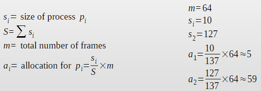

#### Reemplazo de páginas

- Qué sucede si ocurre un fallo de página y todos los marcos están ocupados -> “Se debe seleccionar una página víctima”
- ¿Cual sería Reemplazo Optimo?
  - Que la página a ser removida no sea referenciada en un futuro próximo
- La mayoría de los reemplazos predicen el comportamiento futuro mirando el comportamiento pasado.

#### Alcance del Reemplazo

- Reemplazo Global
  - El fallo de página de un proceso puede reemplazar la página de cualquier proceso.
  - El SO no controla la tasa de page-faults de cada proceso
  - Puede tomar frames de otro proceso aumentando la cantidad de frames asignados a él.
  - Un proceso de alta prioridad podría tomar los frames de un proceso de menor prioridad
- Reemplazo Local
  - El fallo de página de un proceso solo puede reemplazar sus propias páginas – De su Conjunto Residente
  - No cambia la cantidad de frames asignados
  - El SO puede determinar cual es la tasa de page-faults de cada proceso
  - Un proceso puede tener frames asignados que no usa, y no pueden ser usados por otros procesos.

#### Algoritmos de Remplazo

- **OPTIMO** Es solo teórico
- **FIFO** Es el más sencillo
- **LRU** (Least Recently Used): Requiere soporte del hardware para mantener timestamps de acceso a las páginas. Favorece a las páginas mas recientemente accedidas
- **2da. Chance** Un avance del FIFO tradicional que beneficia a las páginas mas referenciadas
- **NRU** (Non Recently Used):Utiliza bits R y M
- **Favorece** a las páginas que fueron usadas recientemente

