<h1 align="center"> 🐧 Resumen Teorico</h1>

---

# Sistemas Operativos

- [Sistema Operativo](#sistema-operativo)
- [Funciones principales](#funciones-principales)
- [Problemas que debe evitar](#problemas-que-debe-evitar-un-so)
- [Componentes](#componentes)
  - [Kernel (Núcleo)](#kernel-nucleo)
    - [Monolítico](#monolitico)
    - [Microkernel](#microkernel)
    - [Monolítico Vs. Microkernel](#monolitico-vs-microkernel)
- [Servicios](#servicios)
  - [Apoyo del Hardware](#apoyo-del-hardware)
  - [Modos de ejecución](#modos-de-ejecución)
  - [Protección](#protecciones)
    - [Protección de la memoria](#protección-de-la-memoria)
    - [Protección de la E/S](#protección-de-la-es)
    - [Protección de la CPU](#protección-de-la-cpu)
  - [System Calls](#system-calls)
- [Elementos Básicos de una computadora](#elementos-basicos-de-una-computadora)

---

## Sistema Operativo
- Es software
  - Necesita un procesador y memoria para ejecutarse
- Dos Perspectivas
  - De arriba hacia abajo
  - De abajo hacia arriba
- Gestiona el HW
- Controla la ejecución de los procesos
- Interfaz entre aplicaciones y HW
- Actúa como intermediario entre un usuario de una computadora y el HW de la misma

### Perspectiva de arriba hacia abajo
- Abstracción con respecto a la arquitectura
  - **Arquitectura** conjunto de instrucciones, organización de memoria, E/S, estructura de bus
- El SO **oculta** el HW y presenta a los programas como abstracciones más simples de manejar.
- Los programas de aplicación son los **clientes** del SO.
- **Comparación**: uso de escritorio y uso de comandos de texto
- Comodidad, **amigabilidad** (friendliness)

### Perspectiva de Abajo hacia arriaba
- Visión del SO como un administrador de recursos
- Administra los recursos de HW de uno o más procesos
- Provee un conjunto de servicios a los usuarios del sistema
- Maneja la memoria secundaria y dispositivos de I/O.
- Ejecución simultánea de procesos
- Multiplexación en tiempo (CPU) y en espacio (memoria)

### Objetivos 
- **Comodidad** Hacer mas fácil el uso del hardware (PC, servidor, switch, router, controlador específico)
- **Eficiencia** Hacer un uso más eficiente de los recursos del sistema
- **Evolución** Permitir la introducción de nuevas funciones al sistema sin interferir con funciones anteriores

---

## Funciones principales
- Brindar abstracciones de alto nivel a  los procesos de usuario
- Administrar eficientemente el uso de  la CPU
- Administrar eficientemente el uso de la memoria
- Brindar asistencia al proceso de E/S por parte de los procesos

## Problemas que debe evitar un so

- Que un proceso se apropie de la CPU
- Que un proceso intente ejecutar instrucciones privilegiadas (Ej: E/S)
- Que un proceso intente acceder a una posición de memoria fuera de su espacio permitido.
  - Proteger los espacios de direcciones

Para ello debe

- Gestionar/controlar el uso de la CPU
- Detectar intentos de ejecución de instrucciones privilegiadas
- Detectar accesos ilegales a memoria
- Proteger el vector de interrupciones
  - Así como las RAI (Rutinas de atención de interrupciones)

---

## Componentes
- **Kernel**
- **Shell** GUI / CUI o CLI
- **Herramientas** Editores, Compiladores, Librerías, etc.

---

### Kernel (Nucleo)

Es una **`Porción de código`** que se encuentra en memoria principal y se encarga de la administración de los recursos

Implementa servicios esenciales:
- Manejo de memoria 
- Manejo de la CPU
- Administración de procesos
- Comunicación y Concurrencia
- Gestión de la E/S

#### Monolitico

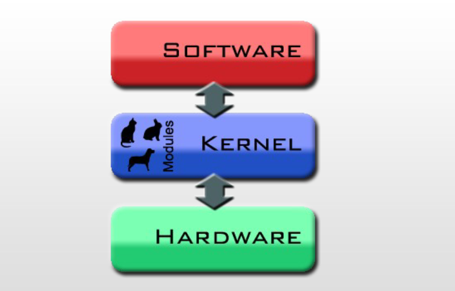

#### Microkernel

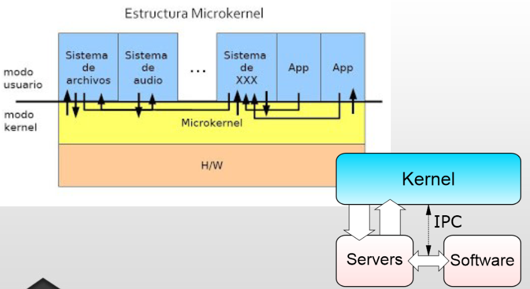

### Monolitico vs Microkernel
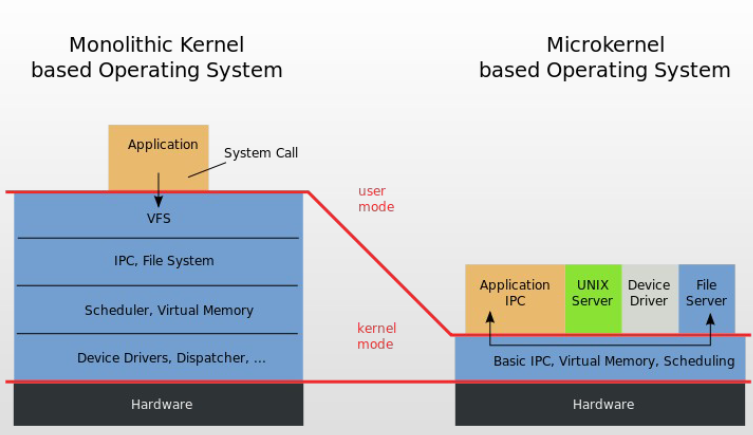

---

### Servicios

- **Administración y planificación del procesador**
  - Multiplexacióon de la carga de trabajo
  - Imparcialidad, **justicia** en la ejecución (Fairness) 
  - Que no haya bloqueos
  - Manejo de Prioridades
- **Administración de Memoria**
  - Administración de memoria eficientemente
  - Memoria física vs memoria virtual. Jerarquías de memoria
  - Protección de programas que compiten o se ejecutan concurrentemente
- **Administración del almacenamiento** (Sistema de archivos)
  - Acceso a medios de almacenamiento externos
- **Administración de dispositivos**
  - Ocultamiento de dependencias de HW
  - Administración  de accesos simultáneos
- **Detección de errores y respuestas**
  - Errores de HW internos y Externos
    - Errores de Memoria/CPU
    - Errores de Dispositivos
  - Errores de SW
    - Errores Aritméticos
    - Acceso no permitido a direcciones de memoria
  - Incapacidad del SO para conceder una solicitud de una aplicación
- **Interacción del Usuario (Shell)**
- **Contabilidad**
  - Recoger estadísticas del uso
  - Monitorear parámetros de rendimiento
  - Anticipar necesidades de mejoras futuras
  - Dar elementos si es necesario facturar  tiempo de procesamiento

---

### Apoyo del Hardware

#### Modos de Ejecución
Define limitaciones en el conjunto de instrucciones que se puede ejecutar en cada modo

- El bit en la CPU indica el modo actual
- Las instrucciones privilegiadas deben ejecutarse en modo **Supervisor o Kernel**
  - Necesitan acceder a estructuras del kernel, o ejecutar código que no es del proceso
- En modo **Usuario**, el proceso puede acceder sólo a su espacio de direcciones, es decir a las direcciones “propias”.
- El kernel del SO se ejecuta en modo supervisor
- El resto del SO y los programas de usuario se ejecutan en modo usuario (subconjunto de instrucciones permitidas)

Datos de Color

- Procesador Intel 8088 no tenía modo dual de operación ni protección por hardware.
- En MsDos las aplicaciones pueden acceder directamente a las funciones básicas de E/S para escribir directamente en pantalla o en disco.

Tener en cuenta que
- Cuando se arranque el sistema, arranca con el bit en modo supervisor. 
- Cada vez que comienza a ejecutarse un proceso de usuario, este bit se DEBE PONER en modo usuario.
  - Mediante una Instrucción especial.
- Cuando hay un trap o una interrupción, el bit de modo se pone en modo Kernel.
  - Única forma de pasar a Modo Kernel
  - No es el proceso de usuario quien hace el cambio explicitamente.

Como Actua

Cuando el proceso de usuario intenta por sí mismo ejecutar instrucciones que pueden causar problemas (las llamadas instrucciones privilegiadas), el HW lo detecta como una operación ilegal y produce un trap al SO.

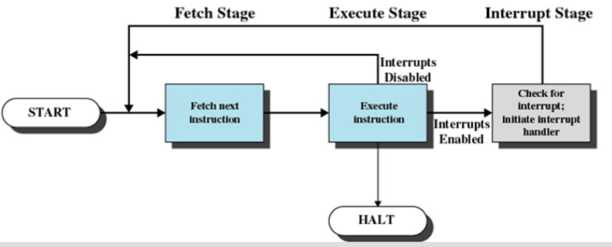

En windows

- En WIN2000 el modo núcleo ejecuta los servicios ejecutivos. El modo usuario ejecuta los procesos de usuario. 
- Cuando un programa se bloquea en modo usuario, a lo sumo se escribe un suceso en el registro de sucesos. Si el bloqueo se produce estando en modo supervisor se genera la BSOD (pantalla azul de la muerte).

### En resumen

Modo kernel
- Gestión de procesos: Creación y terminación ,  planificación, intercambio, sincronización y soporte para la comunicación entre procesos
- Gestión de memoria: Reserva de espacio de direcciones para los procesos, Swapping, Gestión y páginas de segmentos
- Gestión E/S: Gestión de buffers, reserva de canales de E/S y de dispositivos de los procesos
- Funciones de soporte: Gestión de interrupciones, auditoría, monitoreo

Modo usuario
- Debug de procesos, definición de protocolos de comunicación gestión de aplicaciones (compilador, editor, aplicaciones de usuario
- En este modo se llevan a cabo todas las tareas que no requieran accesos privilegiados
- En este modo no se puede interactuar con el hardware
- El proceso trabaja en su propio espacio de direcciones

---

#### Interrupción  de Clock
Se debe evitar que un proceso se apropie de la CPU

---

### Protecciones

#### Protección de la Memoria

Se deben definir límites de memoria a los que puede acceder cada proceso (registros base y límite)

- Delimitar el espacio de direcciones del proceso
- Poner limites a las direcciones que puede utilizar un proceso
  - Por ejemplo: Uso de un registro base y un registro límite
  - El kernel carga estos registros por medio de instrucciones privilegiadas. Esta acción sólo puede realizarse en modo Kernel 

La memoria principal aloja al SO y a los procesos de usuario
- El kernel debe proteger para que los procesos de usuario no puedan acceder donde no les corresponde
- El kernel debe proteger el espacio de direcciones de un proceso del acceso de otros procesos.

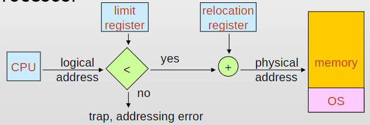

### Protección de la E/S

- Las instrucciones de E/S se definen como privilegiadas. 
- Deben ejecutarse en Modo Kernel
  - Se deberían gestionar en el kernel del sistema operativo 
  - Los procesos de usuario realizan E/S a través de llamadas al SO (es un servicio del SO)

### Protección de la CPU

- Uso de interrupción por clock para evitar que un proceso se apropie de la CPU
- Se implementa normalmente a través de un clock y un contador. 
- El kernel le da valor al contador que se decrementa con cada tick de reloj y al llegar a cero puede expulsar al proceso para ejecutar otro.
- Las instrucciones que modifican el funcionamiento del reloj son privilegiadas. 
- Se le asigna al contador el valor que se quiere que se ejecute un proceso. 
- Se la usa también para el cálculo de la hora actual, basándose en cantidad de interrupciones ocurridas cada tanto tiempo y desde una fecha y hora determinada. 

---

## System Calls

- Es la forma en que los programas de usuario acceden a los servicios del SO.
- Los parámetros asociados a las llamadas pueden pasarse de varias maneras: por registros, bloques o tablas en memoria ó la pila.
  - **count=read(file, buffer, nbytes);**
- Se ejecutan en modo kernel o supervisor

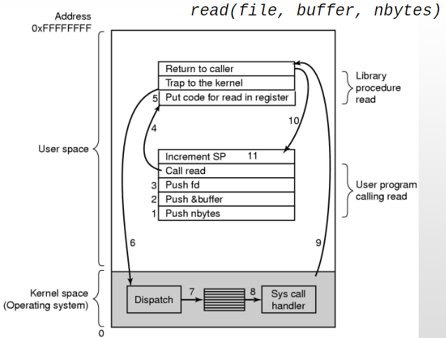

**Categorias**

- Control de Procesos
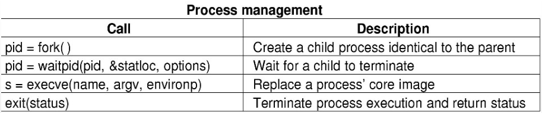
- Manejo de archivos
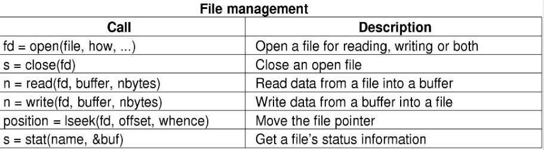
- Manejo de dispositivos
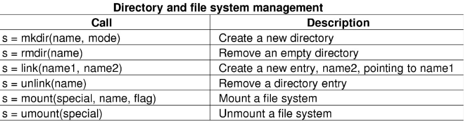
- Mantenimiento de información del sistema
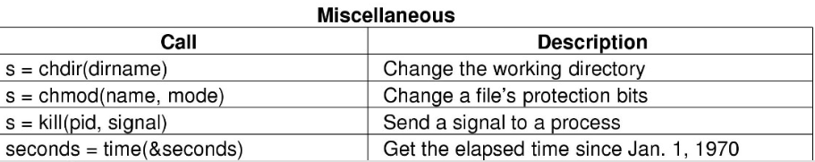
- Comunicaciones

Ejemplo 

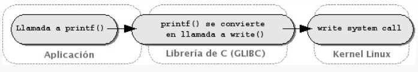

- Para activar iniciar la system call se indica:
  - El número de syscall que se quiere ejecutar 
  - Los parámetros de esa syscall
- Luego se emite una interrupción para pasar a modo Kernel y gestionar la systemcall
- El manejador de interrupciones (syscall handler) evalúa la system call deseada y la ejecuta

Mas ejemplos

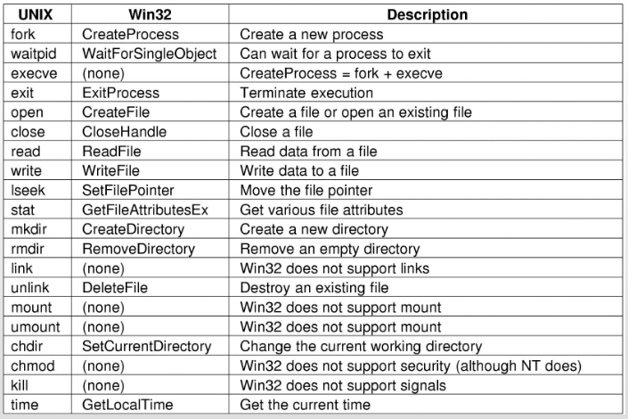

---

# Elementos basicos de una computadora

## Registros del Procesador

### Visibles por el usuario

- Registros que pueden ser usados por las aplicaciones
- Pueden ser referenciados por lenguaje de máquina
- Disponible para programas/aplicaciones
- Tipos de registros
  - Datos 
  - Direcciones
    - Index
    - Segment pointer
    - Stack pointer

### De Control y estado

- Para control operativo del procesador
- Usados por rutinas privilegiadas del SO para controlar la ejecución de procesos

#### Program Counter (PC)
- Contiene la dirección de la proxima instrucción a ser ejecutada

---

#### Instruction Register (IR)
- Contiene la instrucción a ser ejecutada
- La instrucción referenciada por el PC se almacena en el IR y se ejecuta
- Categorías de instrucciones
  - **Procesador - Memoria** (Transfiere datos entre procesador y memoria)
  - **Procesador - E/S** (Transfiere datos a/o desde periféricos)
  - **Procesamiento de Datos** (Operaciones aritméticas o lógicas sobre datos)
  - **Control** (Alterar secuencia de ejecución)

#### Program Status Word (PSW)
- Contiene códigos de resultado de operaciones
- habilita/deshabilita Interrupciones 
- Indica el modo de ejecución (Supervisor/usuario)

### Ciclo de Instrucción

Dos pasos

#### Fetch (Procesador lee la instrucción desde la memoria)

- El procesador busca (fetch) la instrucción en la memoria
  - (PC) → IR
- El PC se incrementa después de cada fetch para apuntar a la próxima instrucción
  - PC = PC + 4

#### Execute (Procesador ejecuta la instrucción)

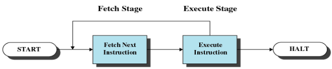

---

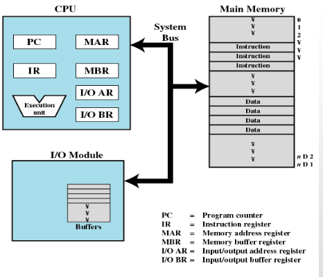

## Interrupciones

- Interrumpen el secuenciamiento del procesador durante la ejecución de un proceso
- Dispositivos de E/S más lentos que el procesador (Procesador debe esperar al dispositivo)

| Flujo de control SIN  interrupciones | Flujo de control CON  interrupciones |
| --- | --- |
| 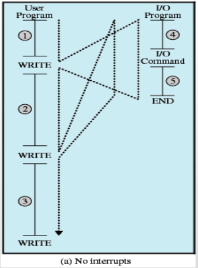 | 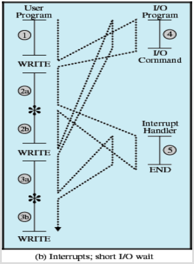 |

### Interrupt Handler

- Programa (o rutina) que determina la naturaleza de una interrupción y realiza lo necesario para atenderla
  - Por ejemplo, para un dispositivo particular de E/S
- Generalemente es parte del SO

Suspende la secuencia normal de ejecución

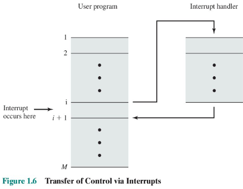

Ciclo de interrupción

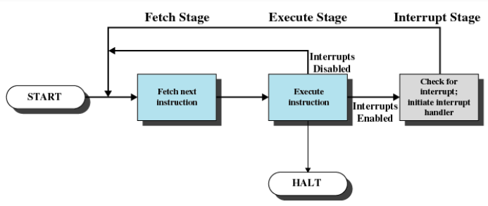

- El procesador chequea la existencia de interrupciones. 
- Si no existen interrupciones, la próxima instrucción del programa es ejecutada
- Si hay pendiente alguna interrupción, se suspende la ejecución del progama actual y se ejecuta la rutina de manejo de interrupciones

Simple Interrupt Processing

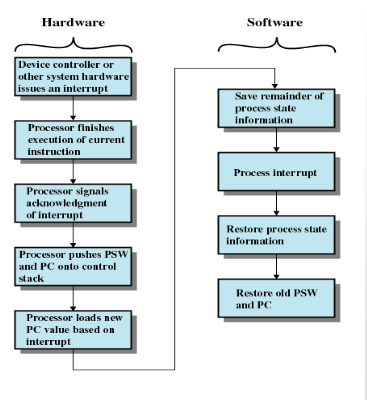

Multiples Interrupciones

Deshabilitar las interrupciones mientras una interrupción está siendo procesada.

| 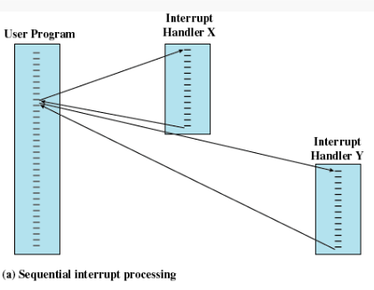 | 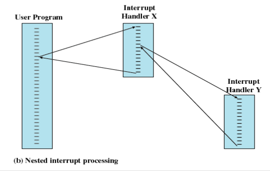 |
| --- | --- |

---

- Memoria Principal
  - Volátil
  - Se refiere como memoria real o primaria
- Componentes de E/S
  - Dispositivos de memoria secundaria
  - Equipamiento de comunicación
  - Monitor / teclado / mouse
- Bus Sistema
  - comunicación entre procesadores, memoria, dispositivos de E/S